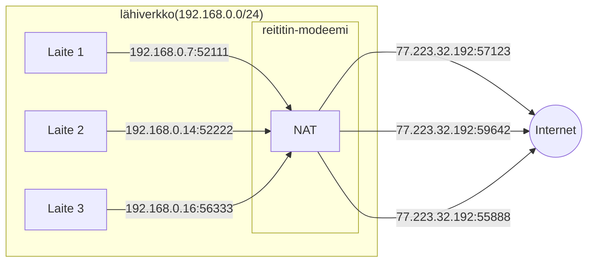

### NAT

IPv4 on 32-bittinen osoite, kuten aiemmissa luvuissa on todettu. Tämä mahdollistaa noin `2 ** 32` eli `4 294 967 296` uniikkia ip-osoitetta. Aiemmassa luvussa todettiin myös, että IP-osoitteet luokitellaan puuhierarkiaan noudattaen aliverkon peitteiden avulla. Tämä mahdollistaa kohtalaisen hienojakoisen jaottelun, jolloin käyttämättömiä hukkaosoitteita ei jää niin paljon yli kuin niitä jäisi A, B ja C-osoiteluokkia käytettäessä. Tästä huolimatta tarve on merkittävästi suurempi kuin mitä IPv4 mahdollistaa.

!!! question "Tehtävä"
    Etsi netistä tilastotietoa, joka pyrkii vastaamaan kysymykseen: kuinka monta laitetta on kytkettynä Internettiin. Vinkki: lisää hakusanoihin "internet of things".

!!! question "Tehtävä"
    Laske tai tarkista reititin-modeemisi asetuksista, kuinka monta IP-osoitteellista laitetta sinun kotonasi on. Ota huomioon myös mobiililiittymiä käyttävät laitteet kuten puhelimet.

NAT eli Network Address Translation on ratkaisu, tai ainakin jonkinlainen väliaikainen ratkaisu, IP-osoitteiden riittämättömyyteen. Pidempiaikainen ratkaisu piilee IPv6-protokollassa, joka mahdollistaa `2 ** 128` eli `340 282 366 920 938 463 463 374 607 431 768 211 456` uniikkia IP-osoitetta. Voi toki olla, että tietoturvasyistä ainakin kotiverkoissa tullaan myös IPv6:n aikana käyttämään NAT:ia tai sitä muistuttavia protokollia, mutta tähtitieteellisen suuri osoiteavaruus mahdollistaa myös sen, että jokaista fyysistä osoitetta vastaa tasan yksi IPv6-osoite. NAT:n tarjoama ratkaisu perustuu siihen, että privaatin IP-osoiteavaruuden kentät vaihdetaan NAT-laatikossa laatikon itsensä osoitteeksi. Myös portit pitää mapata uusiksi, ja ylläpitää näistä muunnoksista rekisteriä, jotta päällekäisiltä porteilta vältytään. Yksittäiset tietokoneet eivät keskustele käyttämistään porteista keskenään, joten ilman porttien vaihtamista on mahdollista, että kaksi konetta valitsee satunnaisesti saman portin käyttöönsä. NAT-laatikolla ei olisi mahdollisuutta tunnistaa, kummalle koneista paketti kuuluu, ellei portteja ole vaihdettu. Alla oleva kaaviokuva esittää tilannetta, jossa kaksi tietokonetta keskustelee Internetissä olevan koneen kanssa. Nuoliin lisätyt luvut edustavat IP-paketin lähteen osoitetta (eng. source.) Kohde (eng. destination) pysyy muuttamattomana.

NAT on pidentänyt IPv4-avaruuden elinikää, mutta täysin ongelmaton se ei ole. Tämän on voinut havaita esimerkiksi verkkomoninpelejä mobiililiittymällä pelatessa. Tyypillisesti mobiililiittymät toimivat siten, että NAT tapahtuu jo operaattorin päässä kerran. Kotona oleva reititin-modeemi "natittaa" jo kerran "natitetun" viestin. Tästä voi aiheutua ongelmia peliserverille pääsyn tai VoiP-keskustelukanavan käytön kanssa. Erikseen aktivoitava 'Julkinen IP' poistaa operaattorin päässä tapahtuman natituksen, mikä yleensä helpottaa - mutta yksi NAT jää kuitenkin jäljelle. NAT on OSI-mallin kerrosten kannalta ongelmallinen. NAT itsessään on OSI:n kerroksen 3, eli Networkin, protokolla, mutta sillä on todella vahva sidos itseään ylempien kerrosten toteutukseen: se nimittäin puuttuu payloadin sisältöön koskemalla IP-osoitteisiin ja portteihin. Tämä vaatii muun muassa virheentarkistukseen käytettävien "checksum"-kenttien uudelleenlaskentaa. NAT on mainio esimerkki siitä, että mallit ovat malleja, ja käytännön toteutukset ovat käytännön toteutuksia. Mikäli käytännön toteutus vaatii, mallin on pakko taipua mukana.