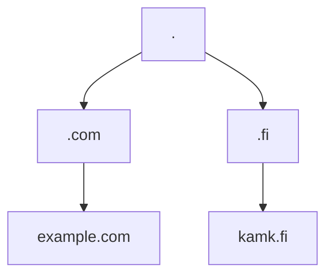

# Nimet

Edellisessä luvussa esitellyt IP-osoitteet ovat hankalia muistaa. Ratkaisu tähän on antaa nimi eri IP-osoitteille, kuten `example.com` - tai vielä tarkemmin `example.com.`. TCP/IP Domain Name System (DNS) on protokolla, joka määrittelee Internet-nimien nimiavaruuden (eng. name space), kuinka nimi käännetään IP-osoitteeksi ("resolvataan", eng. resolve), kuinka tuloksia säilötään välimuistissa ja niin edelleen. Protokolla on applikaatiotason-protokolla, ja hyödyntää alemman kerroksen UDP-porttia 53. 

DNS on hierarkinen nimiavaruus, aivan kuten tietokoneen hakemistorakenne (`/kansio/alikansio/alempikansio/`), jossa erottimena toimii piste (`.`), ja sisäkkäiset hierarkiat listataan oikealta vasemmalle. Abstrakti esimerkki on `4.3.2.1.`, konkreettisempi esimerkki on `kolmanneksi-ylin.toiseksi-ylin.example.com.`. Käytännössä osoitteessa voi olla hyvinkin monta kerrosta, kuten `a.b.c.d.e.f.g.h.i.example.com.`. Puu alkaa juuresta (`.`). Mikäli halutaan tehdä selväksi, että annettu osoitepolku on kokonainen (Fully Qualified) eikä osittainen (Partially Qualified), niin osoitteeseen jätetään myös juuren piste näkyville. Vertaa näitä kahta: `a.com.`, `a.com`. Jälkimmäinen voi teoriassa jossakin ympäristössä olla vain osittainen osoite, ja viitata vaikkapa polkuun `a.com.something.fi`.


**Kuvio 1:** *DNS-puurakenne. Kerrokset ylhäältä alas ovat englanniksi: root, top-level domain (TLD), 2nd level domain (SLD).*

Kaukana historiassa Internet, tai sitä edeltävä ARPAnet, oli niin pieni, että nimet oli mahdollista ylläpitää yhdessä tiedostossa. Linuxissa tämä löytyy yhä tiedostosta `/etc/hosts` ja Windowsissa tiedostosta `C:\Windows\System32\drivers\etc\hosts`. Yhä 2020-luvullakin kyseinen tiedosto on ensisijainen nimen resoluution lähde, mikä voi olla lokaalissa kehittämissä hyödyllinen ominaisuus. Esimerkiksi Docker lisää tiedostoon rivejä, jotka muistuttavat tätä `192.168.178.37  host.docker.internal`. Tämä aiheutta sen, että `host.docker.internal` ohjaa jatkossa osoitteeseen `192.168.178.37` eikä osoitetta yritetä etsiä Internetin uumenista. Nykyään Internetissä on aivan liikaa nimiä yksittäisen palvelimen ylläpidettäväksi, joten työ on hajautettu.

!!! question "Tehtävä"
    Käy kurkkaamassa, mitä sinun käyttöjärjestelmäsi hosts-tiedosto sisältää. Ethän muokkaa tiedostoa.

## Nimien rekisteröinti

Suoraan juuressa perään määritellyt domainit ovat verkkosivun päätteitä (eng. Top-Level Domain, TLD). TLD:t määritellään Root Zone Databasessa ja lista niistä löytyy [ICANN:n sivuilta](https://www.iana.org/domains/root/db). Huomaa, että TLD:tä ei tavallisesti rekisteröi yksilöt; pelkkä hakemus on satoja tuhansia, ja ylläpito kymmeniä tuhansia euroja vuodessa. TLD:t luokitellaan maakohtaisiin (ccTLDs) ja geneerisiin (gTLD), joista ensimmäiset ovat eri maiden kaksikirjaimia maatunnuksia.

!!! question "Tehtävä"
    Käy tarkistamassa [ICANN:n sivuilta](https://www.iana.org/domains/root/db), kuka hallinnoi seuraavia, melko yleisiä verkkotunnuksia: `.fi`, `.com`, `.ai`, `.app`.

TLD:tä hallinnoiva taho (esim. Verisign `.com`:n tapauksessa) ylläpitää TDL:tä, ei suinkaan ylläpidä listaa kaikista `.com`-verkkotunnukseen päättyvistä osoitteista. 

Mikäli haluat rekisteröidä oman second-level domain-nimen, kuten `tietoliikenneohjelmointi.club` tai `tietoliikenneohjelmointi.com`, sinun tulee valita sopiva verkkotunnusvälittäjä. Verisign ja muut TLD:tä hallinnoivat tahot eivät siis rekisteröi sinulle nimeä, vaan ovat delegoineet tuon työn muille yrityksille. Kun rekisteröit domainin, domainilla tarvitsee olla DNS-nimipalvelin (name server), jotta resolverit voivat löytää palveluidesi IP-osoitteet. Huomaa myös, että aliverkkotunnuksia ei tarvitse lähtökohtaisesti erikseen rekisteröidä (esim. `python.tietoliikenneohjelmointi.club`): mikäli omistat domainin, voit lisätä aliverkot itse DNS-vyöhyketiedostoon.

!!! question "Tehtävä"
    Käy tutustumassa esimerkiksi [GoDaddy-verkkotunnusvälittäjän ohjeisiin](https://fi.godaddy.com/help/verkkotunnukset-1000003). 
    
    1. Löydätkö ohjeet, kuinka rekisteröidä domain ja käyttää GoDaddyn hallinnoimia nimipalvelimia? 
    2. Entä kuinka toimisit, jos haluat käyttää GoDaddyn kautta rekisteröidyn osoitteen kanssa AWS Route 53 -nimipalvelinta?

## Nimen ja IP:n yhdistäminen

Nimen kääntäminen IP-osoitteeksi vaatii asiakasohjelman (`DNS resolver`) ja palvelimen (`DNS (root) name server`). Kun kirjoitat osoitekenttään `example.com`, verkkoselain keskustelee Ethernet-asetuksissa määritellyn resolverin kanssa. Resolveri käynnistää rekursiivisen haun, ja palauttaa IP-osoitteen, mikäli sellainen löytyi. Käytetty resolveri voi olla esimerkiksi reitittimessäsi, tai internetpalveluntarjoajan tiloissa, tai voit käyttää jotakin julkisesti avointa DNS-resolveria, kuten Googlea (IP-osoitteet `8.8.8.8` ja `8.8.4.4`). Mikäli haluat tarkistaa mitä tietokoneesi käyttää nyt, voit tehdä sen alla olevien komentojen avulla. DNS-tietueita (eng. DNS Records) ylläpidetään nimipalvelimilla (eng. name servers). Suurimman auktoriteetin nimipalvelimet ovat juurinimipalvelimet (eng. root name servers), jotka on nimetty muotoon: `a.root-servers.net`. Lista kaikista juurinimipalvelimista löytyy [IANA:n sivuilta](https://www.iana.org/domains/root/servers) IP-osoitteineen. Root Name Server ei ylläpidä listaa kaikista maailman osoitteista: se tietää vain, mitkä nimipalvelimet vastaavat TLD:stä. TLD:n nimipalvelin ei myöskään pidä listaa kaikista verkkotunnuksen alaisista second-level domaineista, mutta se tietää missä on näiden nimipalvelimet.

```powershell
# PowerShell
Get-NetAdapter | Where-Object { $_.Status -eq "Up" } | Get-DnsClientServerAddress

# Bash
cat /etc/resolv.conf | grep "nameserver"

# Command Prompt
ipconfig /all
```

Prosessi menee jotakuinkin näin:

1. Tietokoneesi kysyy resolverilta, missä on `www.icann.org`
2. Resolveri kysyy juurinimipalvelimelta, missä on `www.icann.org`. Root Name Server ei luonnollisesti tiedä tätä, mutta osaa kertoa `.org`:n nimipalvelimet. Yksi näistä on `a2.org.afilias-nst.info`, jonka A-record eli IPv4-osoite on  `199.19.56.1`.
3. Resolveri kysyy `.org`:n nimipalvelimelta, missä on `www.icann.org`. TLD:sä vastaava nimipalvelin ei tiedä tätä, mutta osaa kertos `icann.org`:n nimipalvelimet. Yksi näistä on `ns.icann.org`, jonka IPv4 osoite on `199.4.138.53`.
4. Resolveri kysyy `icann.org` nimipalvelimelta, missä on `www.icann.org`. Verkkotunnuksen nimipalvelin ei myöskään tiedä tätä, mutta osaa kertoa, että `www.icann.org` CNAME-record eli alias on `www.vip.icann.org`, ja yksi sen nimipalvelimista on `gtm1.dc.icann.org`, jonka A-record eli IPv4-osoite on `192.0.47.252`
5. Resolveri kysyy `gtm1.dc.icann.org` nimipalvelimelta, missä on `www.vip.icann.org`. Nimipalvelin vastaa, että A-record eli IPv4-osoite on `192.0.32.7`.

Huomaa, että mikäli olet äskettäin vieraillut `www.icann.org`-sivustolla, tai `www.vip.icann.org`-sivustolla, DNS-resolveri palauttaa IPv4-osoitteen välimuistista eikä tee uutta kyselykierrosta. Huomaa myös, että kummatkin sivustot käyttävät samaa IP-osoitetta. Www-palvelin on konfiguroitu siten, että sama IP-osoite osaa palauttaa eri sivuston käyttäjälle riippuen HTTP-kyselyssä määritellystä osoitteesta. Mikäli yrität vierailla osoitteessa `https://192.0.32.7`, näet nimenomaan `*.vip*`-sivuston.

!!! question "Tehtävä"
    Miten ratkaista :egg::chicken:-ongelma: et voi ylipäätänsä tehdä ensimmäistä kyselyä, jos et tiedä mikä on esimerkiksi `a.root-servers.net`-juuripalvelimen IP-osoite. Selvitä, mistä DNS resolver lukee juurinimipalvelimien osoitteet. 

!!! questin "Tehtävä"
    Mikäli sinulla on Linux tai muuten vain dig asennettuna, kokeile ajaa:

    ```sh
    # Jos haluat nähdä rekursiivisen haun vaiheet alkaen root serveristä
    dig +trace @a.root-servers.net $URL
    
    # Jos haluat nähdä ihan vain ip-osoitteen
    dig $URL
    
    # Jos tiedät ip-osoitteen, mutta yrität päätellä kenen se on:
    dig -x $IP
    ```
