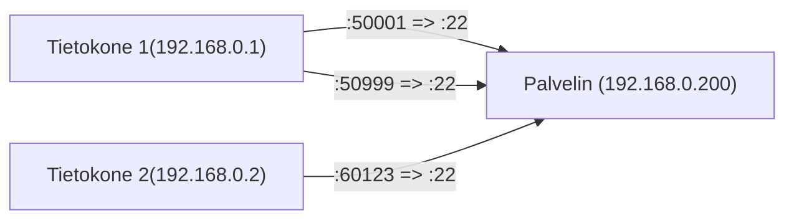
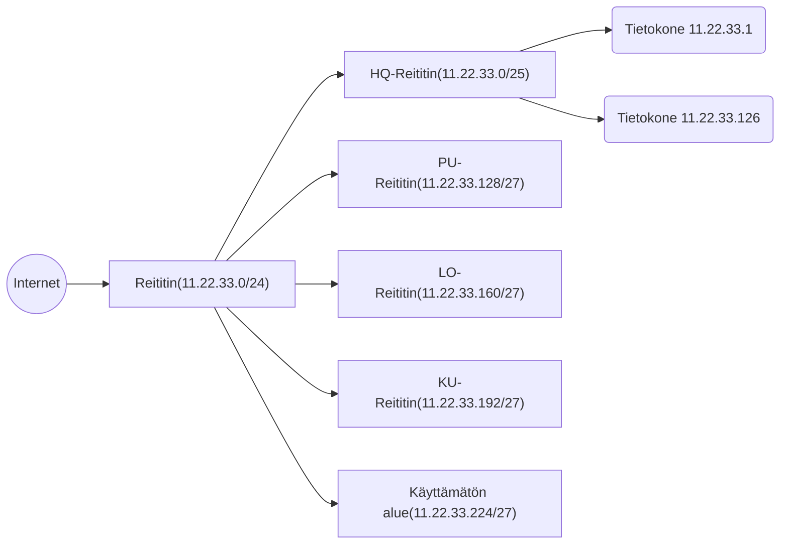

# Osoitteet

Tämän otsakkeen alla käydään käytännössä läpi se, kuinka aiemmin mainittujen laitteiden osoitteet näkyvät käyttäjälle, ja mistä osatekijöistä numerot koostuvat. Osoitteet on helposti jaettavissa fyysisiin (OSI-mallin taso 2) ja loogisiin (taso 3).

### Fyysinen osoite

Tietokoneen verkkokortilla (eng. network interface card, NIC) tulee olla jokin uniikki ID, eli tunnus, jolla se voidaan yksilöidä, jotta lähiverkossa viestiminen on mahdollista. Tätä voi verrata ihmisten kohdalla sosiaaliturvatunnukseen, mutta tosin sillä erolla, että Internetissä fyysisen osoitteen tulee olla globaali. Sosiaaliturvatunnukset ovat yleensä päteviä vain yhden valtion rajojen sisällä. Toinen merkittävä ero sosiaaliturvatunnukseen on se, että tietokoneessa voi olla monta eri verkkokorttia: Ethernet, Wireless Ethernet, Bluetooth ja niin edelleen. Näillä jokaisella tulee olla uniikki ID. Tehtaalla valmistetuilla verkkolaitteilla on tehtaalla päätetty ID eli MAC-osoite. Pitkältä nimeltään MAC on monipalvelujärjestelmäliittymän ohjaus (eng. Media Access Control Address), mutta käytännössä siitä käytetään aina lyhennettä.

MAC-osoite on 48-bittinen eli 6-tavuinen. Alla on esitettynä ASCII-representaatio, jossa on kaikki vaihtoehdot sellaisille unicast-osoitteille, jotka ovat lokaalisti hallittuja. Jos haluat generoida sattumanvaraisen MAC-osoitteen, jonka ei tarvitse olla uniikki, niin korvaa kaikki binäärin x:t satunnaisesti ykkösellä tai nollalla.

```
# Binääri
|---------- OUI ---------||---------- NIC ----------|
xxxxxx10-xxxxxxxx-xxxxxxxx-xxxxxxxx-xxxxxxxx-xxxxxxxx

# Heksadesimaali
X2-XX-XX-XX-XX-XX
tai
XA-XX-XX-XX-XX-XX
```

!!! question
	Jos sinulla on virtuaalikone, niin sillä on todennäköisesti myös virtuaalinen verkkokortti, jolloin se ei saa MAC-osoitetta tehtaalta. Minkä MAC-osoitteen kortti saa? Missä skoopissa sen tulee olla uniikki? Globaalisti? Suomessa? Kajaanissa?

!!! question
	Yllä olevassa ASCII-esimerkissä on kaksi lyhennettä: OUI ja NIC. Ensimmäinen on valmistajan tai omistajan suhteen uniikki prefix (Organisationally Unique Identifier), jälkimmäinen on NIC:n eli verkkortin eli yksittäisen laitteen suhteen uniikki. Kokeile tätä käytännössä! Aja jokin alla olevista käskyistä käyttöjärjestelmäsi mukaan, etsi haluamasi laitteen MAC-osoite, ja käy syöttämässä ensimmäiset kolme oktettia (`XX-XX-XX`) [Miniwebtoolin MAC Address Lookuppiin](https://miniwebtool.com/mac-address-lookup/).

~~~bash
```
# Windows komentokehote
ipconfig \all

# Linux bash
ip -o link | awk '$2 != "lo:" {print $2, $(NF-2)}'

# PowerShell
Get-NetAdapter -IncludeHidden | Select Name, MacAddress

# macOS
networksetup -listallhardwareports
```
~~~

### Looginen osoite

Jotta TCP/IP-protokollan käyttö olisi mahdollista, verkkokortille on täytynyt osoittaa looginen osoite, joka IP-protokollan tapauksessa on IP-osoite. IPv4-osoite on 4-tavuinen eli 32-bittinen numero. Yleisin esitystapa on desimaalinumero per tavu, kuten `192.168.0.1`. Katso alla olevasta taulukosta, kuinka tämä kääntyy heksadesimaaliksi ja desimaaliksi.

| Esitystapa                 | IP-osoite                             |
| -------------------------- | ------------------------------------- |
| Binääri                    | `11000000 10101000 00000000 00000001` |
| Heksadesimaali             | `C0 A8 00 01`                         |
| Piste-erotellut desimaalit | 192.168.0.1                           |

!!! question
    Selvitä sinun IPv4-osoitteesi on lähiverkossa. Tämä onnistuu komennoilla:

~~~bash
```
# Windows komentokehote
ipconfig

# Linux bash
ip -4 addr show

# PowerShell
Get-NetIPAddress -AddressFamily IPv4 | Select-Object InterfaceAlias, IPAddress

# macOS
networksetup -listallnetworkservices # Listaa ja hae infot (1)
networksetup -getinfo "Wi-Fi"
```
~~~

1. Yksi tapa macOS:llä on ensin listata ylemmällä komennolla kaikki network servicet, ja sitten yksi kerrallaan kutsua `-getinfo "Name of the Service"`.

!!! question "Tehtävä"
    Tutustu IPv6:een. Miten se eroaa IPv4:stä?

!!! question "Tehtävä"
    Miksi sinun kotikoneesi IP-osoite on juuri se? Oletko määritellyt sen käsin vai saanut jostain? Tutustu TCP/IP-protokollaan nimeltään DHCP. Mitä ongelmia se ratkaisee?

### Applikaation looginen osoite

IP-osoitteen lisäksi on hyvä tietää, että myös applikaatiolla on oma looginen osoitteensa. TCP/IP-protokollaperheessä näitä ovat portit, ja niitä on kahta sorttia: TCP-portti ja IP-portti. Tämä mahdollistaa sen, että yhdessä tietokoneessa voi toimia monta applikaatiota, jotka käyvät keskustelua toisen tietokoneen applikaation kanssa. Internet ja ylipäätänsä TCP/IP-verkot toimivat asiakas-palvelinmallia (eng. client-server) käyttäen. Asiakas on aina yhteyden avaava osapuoli, ja palvelin on kuunteleva osapuoli. Kun TCP-yhteys avataan, yhteys muodostuu applikaation eli portin tasolla. Mikäli sinulla on lähiverkossa serveri `192.168.0.200`, joka kuuntelee porttia `22`, ja otat siihen TCP-protokollaa käyttäen useamman yhteyden, niin yhteydet määrittyvät esimerkiksi alla olevan kuvan mukaisesti. IP-osoitteen ja portin muodostamasta parista käytetään termiä ==socket==. Huomaa, että Tietokoneella 1 on kaksi yhtäaikaista yhteyttä Palvelimeen, ja paluuposti voidaan ohjata oikealle applikaatiolle nimenomaan portin avulla. Huomaathan, että TCP- ja UDP-portit voivat keskenään jakaa saman numeron eri käyttöihin. Sekaannusten välttelemiseksi palvelinpuolen portit on yleensä varattu sekä TCP:n että UDP:n puolelta, vaikka protokolla käyttäisi vain toista -  HTTP:lle on merkattu sekä TCP/80 että UDP/80, vaikka HTTP-protokolla käyttääa aina TCP-protokollaa.



Palvelimille ja nimenomaan tietyille palvelimien käyttämille applikaatio-tason protokollille on varattu omat portit. Tarkka lista löytyy [IANA:n sivuilta](https://www.iana.org/assignments/service-names-port-numbers/service-names-port-numbers.xhtml), tai hieman helpommin luettavassa muodossa [Wikipediasta](https://en.wikipedia.org/wiki/List_of_TCP_and_UDP_port_numbers). Käy kurkkaamassa mitkä protokollat tunnistat.


!!! question "Tehtävä"
    Verkkoselain täydentää oletusportin protokollan mukaan (HTTP=80, HTTPS=443), mutta kukaan ei estä kirjoittamasta sitä itse osoitteen perään. Kokeile kirjoittaa seuraavat osoitteet osoitekenttään, ja seuraa mitä tapahtuu: `http://www.example.com:80/` ja `https://www.example.com:443/`. 

??? tip
    Yhteys on nimenomaan applikaation välillä, joten sekä asiakassovellukset että palvelinsovellus voivat toimia samalla tietokoneella. Tätä varten on erikseen varattu IP-osoiteavaruus 127.0.0.0, josta useimmiten käytetään vain yhtä loopback-osoitetta 127.0.0.1 (alias `localhost`).

    ```mermaid
    graph LR
    c1["Tietokone 1( 192.168.0.1)"]
    
    c1 -->|192.168.0.1:51111 => 127.0.01:80| c1
    c1 -->|192.168.0.1:55555 => 127.0.01:80| c1
    ```

## IP-osoitteiden luokittelu

### Osoiteluokat

32-bittisestä IP-avaruudesta voi muodostaa yli 4 miljardia (2 potenssiin 32) uniikkia osoitetta, joten on luonnollista, että verkkoa jaetaan tavalla tai toisella pienempiin osoiteluokkiin tai verkkoihin. Aikoinaan Internetissä oli käytössä IP-osoiteluokat A, B C, D ja E. Vaikka osoiteluokista onkin luovuttu 90-luvun alkupuoliskolla, luokkia käyttävään kieleen, kuten "Class A Private Network", törmää yhä, joten osoiteluokista on hyvä olla tietoinen yhä 2020-luvulla. Lisäksi alkuperäinen luokkajako on hyvä askel kohti nykyaikaisen IP-luokittelun ymmärrystä.

Puolet koko IP-avaruudesta oli varattu luokalle A. Binäärilukuavaruus jaettiin kuin piirakka, josta luokka A sai puolet, B sai puolesta puolet, C jäljelle jäävästä puolet, ja D sekä E jakoivat loput kahdestaan. Luokkaan A kuuluivat kaikki IP-osoitteet, joiden binääri alkoi nolalla, eli IP-osoite näytti kokonaisuudessaan tältä: `0xxxxxx xxxxxxx xxxxxxxx xxxxxxxx`. Jotta koko A-luokka ei olisi vain yksi verkko, niin se jaettiin useisiin verkkoihin käyttämällä verkon peitettä (eng. net mask) tai etuliitettä (eng. network prefix). A-luokan tapauksessa verkon peite oli `11111111 00000000 00000000 00000000` eli desimaaleina `255.0.0.0`. Huomaa, että peitteen 8 ensimmäistä bittiä ovat ykkösiä, loput 24 nollia. Käytännössä A-luokan IP-osoite siis noudatti kaavaa `0nnnnnnn xxxxxxxx xxxxxxxx xxxxxxxx`, jossa `n`-kirjaimet edustavat verkkoa ja `x`-kirjaimet hostia. Koska kumpikin näistä muodostaa tunnisteen, kutsutaan niitä nimillä verkon tunniste (eng. network ID) ja isäntä (eng. host ID). Verkon seitsemän `n`-merkkiä voi vaihtaa joko nollaksi tai ykköseksi `2 ** 7` tavalla, eli **teoriassa** luokan A IP-osoiteavaruuksia on 128 kappaletta. 

Luokkaan B kuuluivat jäljelle jääneistä IP-osoitteista kaikki, joissa toinen merkki on 0. B-luokan IP-osoite noudattaa kaavaa eli `10nnnnnn nnnnnnnn xxxxxxx xxxxxxx`. Luokka C jatkaa samaa kaavaa: `10nnnnnn nnnnnnnn nnnnnnnn xxxxxxx`. Luokat D ja E olivat erityiskäyttöä varten varattuja alueita. Luokka D (`1110xxxx`) oli multicastingia varten, E (`1111xxxx`) oli varattu tutkimukseen ja kehitykseen. Tämän ja ylemmän kappaleen teksti on pyritty tiivistämään alla olevaan taulukkoon lisäinformaatiolla maustettuna, poislukien outolinnut D ja E.

| Luokka | Verkon osuus IP-osoitteesta  | # Verkkoa | # IP-osoitetta verkossa |
| ------ | ---------------------------- | --------- | ----------------------- |
| A      | `0nnnnnnn`                   | 128       | 16 777 216              |
| B      | `10nnnnnn nnnnnnnn`          | 16 384    | 65 534                  |
| C      | `110nnnnn nnnnnnnn nnnnnnnn` | 2 097 152 | 254                     |

??? warning 
    Yllä olevan taulukon kaikki IP-osoitteet tai verkon eivät kuitenkaan ole *käytännössä* mahdollisia - paitsi niille varattuun erityiskäyttöön. Esimerkiksi ensimmäinen A-luokan verkon ensimmäinen IP-osoite, `0.0.0.0`, on poikkeus. Itse asiassa koko `0.0.0.0/255.0.0.0` verkko on poikkeus.

!!! question "Tehtävä"
    Yksi B-luokan verkko on noudattaa kaavaa `10111001 10101010 xxxxxxx xxxxxxx`. Verkkoon kuuluu 65 534 IP-osoitetta. Laske mikä IP-osoite on ensimmäinen ja mikä viimeinen. Käytä formaattina piste-eroteltuja desimaalilukuja.

!!! question "Tehtävä"
    B-luokassa on noin 16 000 verkkoa ja C-luokassa noin 2 miljoonaa verkkoa, joita voisi myydä asiakkaille. Ota selvää, kuinka paljon Internetissä on verkkokauppoja (eng. e-commerce sites), ja vertaa sitä näihin lukemiin. Mille osuudelle nykyisistä verkkokaupoista riittäisi oma B-luokka? Kuinka moni yritys todella tarvitsee C-luokkaa eli 65 tuhatta julkista ip-osoitetta? Tarvitsevatko useimmat edes 254 osoitetta?

### Aliverkot

 Verkkojen jakaminen puu-hierarkisesti aliverkkoihin, eli aliverkottaminen (eng. subnetting), on tärkeä askel kohti tilannetta, jossa Internetin ip-osoitteet voidaan jakaa lähes millä tarkkuudella tahansa: yksi yritys voi ostaa 8, toinen 64, ja operaattori tarvitsee 64 tuhatta. Keksintö on pohjimmiltaan hyvin yksinkertainen, kunhan ymmärtää yllä esitetyn network ID:n ja host ID:n konseptin. 

Mikä sitten on aliverkon peite? Kuvitellaan, että luokan A verkot ovat aliverkkoja, vaikka terminologia ei olisikaan historian kanssa täysin pätevä. Luokan A verkon ensimmäinen tavu on muotoa `0nnnnnnn`, eli voi saada arvon 0-127, ja loput tavut sisältävät isäntäkoneelle uniikin Host ID:n. A-luokan osoitteessa ensimmäinen tavu on aina verkon osoite, loput ovat isännän osoitteita. Tämän voi kirjoittaa binäärimaskina muotoon `11111111 00000000 00000000 00000000`, tai desimaaleina muotoon `255.0.0.0`. Mikäli IP-osoitteen ja maskin välillä suorittaa binäärioperaation AND, jäljelle jää verkon osoite. Mikäli maskin ykköset vaihtaa nolliksi ja nollat ykkösiksi, saa host maskin, joka olisi tässä tapauksessa `0.255.255.255`.

Aliverkon peitteen voi kirjoittaa myös äärimmäisen kompaktilla tavalla, eli laskemalla aliverkon peitteen ykköset vasemmalta lukien. Luokan A aliverkossa on 8 ykköstä, joten notaatio olisi "/8". Tätä kutsutaan englanniksi termein "CIDR notation" tai "slash notation".

Kuvitellaan, että ==Yritys X== omistaa luokan C verkon `11.22.33.0` kaikki 256 osoitetta. Aiemman otsakkeen alla määriteltiin, että C-verkossa ensimmäiset kolme tavua määräävät verkon osoitteen, ja viimeinen tavu määrää isäntäkoneen osoitteen. Verkon C aliverkon peite on siis `255.255.255.0`, ja koko verkon voi esittää CIDR-notaatiota käyttäen tiiviisti muodossa `11.22.33.0/24`. Yritys X omistaa 3 konttoria: keskustan pääkonttori (HQ), Purola (PU), Lohtaja (LO) sekä Kuurna (KU). Yhtiön tarvitsee useita julkisia IP-osoitteita, koska se pyörittää useita pelipalvelimia julkiverkossa.

| Konttori | Julkisten pelipalvelimien määrä |     |
| -------- | ------------------------------- | --- |
| HQ       | 103                             |     |
| PU       | 7                               |     |
| LO       | 12                              |     |
| KU       | 9                               |     |

Mikäli Yritys X jakaisi koko 256 osoitteen ip-avaruuden tasan neljään osaan, jokaisessa aliverkossa olisi tasan 64 IP-osoitetta. Tämä ei täytä kriteereitä, koska keskustan pääkonttilla on 103 pelipalvelinta. Verkko tulee siis jakaa keskenään eri mittaisilla aliverkon peitteillä.

1) Annetaan keskustalle puolet koko verkosta eli 128 osoitetta.
    * Tämä onnistuu lisäämällä aliverkon peitteeseen yksi ykkönen lisää
    * Aliverkon peite on desimaaleina `255.255.255.128`.
    * Aliverkon CIDR-notaatio on "/25".
2) Annetaan muille konttoreille kullekin 1/4 jäljelle jääneistä osoitteista eli 32.
    * Tämä onnistuu lisäämällä aliverkon peitteeseen kaksi ykköstä lisää.
    * Aliverkon peite on desimaaleina `255.255.255.224`.
    * Aliverkon CIDR-notaatio on "/27".

Huomaa, että koska binäärinä verkon voi jakaa vain kahdella jaollisiin osiin, yksi osa tulee jäämään reserviin eli täysin käyttämättömäksi alueeksi.




Mikäli Yritys X:n tarvitsee myöhemmin muuttaa aliverkkojen jakoja, sen tarvitsee konfiguroida omat reittitimensä ja niiden reititystaulut uusiksi. Internetistä katsottuna mikään ei muutu: jokainen `11.22.33.0/24` verkkoon kuuluva IP-osoite löytyy yhä saman reitittimen takaa.

!!! question "Tehtävä"
    Yksi yrityksen pelipalvelimista on "serveri-abfh.yritysx.fi" ja sen IP-osoite on 11.22.33.135. Vastaukset löytyvät alla olevasta laatikosta, mutta älä huijaa! Päättele ja laske seuraavat:
    
    * Missä konttorissa palvelin fyysisesti on?
    * Mikä on konttorin aliverkon verkon peite binääri- ja desimaalimuodoissa?

??? tip "Vastaus"
    Palvelin on Purolan konttorissa. Alla olevasta taulukosta löytyvät aliverkon peite, isännän peite (eng. host mask) sekä verkon että isännän ID:t.

    |                 | Binääri                               | Desimaali       |
    | --------------- | ------------------------------------- | --------------- |
    | IP              | `00001011 00010110 00100001 10000111` | 11.22.33.135    |
    | Aliverkon peite | `11111111 11111111 11111111 11100000` | 255.255.255.224 |
    | Isännän peite   | `00000000 00000000 00000000 00011111` | 0.0.0.31        |
    | Verkon ID       | `00001011 00010110 00100001 10000000` | 11.22.33.128    |
    | Isännän ID      | `00000000 00000000 00000000 00000111` | 0.0.0.7         |

### Internet aliverkkoina

Mikäli ymmärsit yllä esitellyt IP-osoiteluokat sekä aliverkot, on helppo ymmärtää kuinka osoiteluokista on luovuttu: koko Internetistä on tehty osoiteluokaton. Ylätasolla on organisaatio, joka jakaa alemman tason organisaatioilla osoite-avaruudesta palasia. Nämä organisaatiot taas jakavat omaa verkkoon aliverkoiksi ja myydän asiakkailleen. Mitä nämä organisaatiot ovat? Se selviää [organisaatioita käsittelevässä luvussa](../protokollat_ja_standardit/organisaatiot.md) tarkemmin, mutta komentoketju on esimerkiksi: IANA => RIPE NCC => Kaisanet. Kattojärjestön eli IANA:n jakamat IP-osoitealueet löytyvät [heidän sivuiltaan](https://www.iana.org/assignments/ipv4-address-space/ipv4-address-space.xhtml). Kaisanet voi myydä omistamistaan CIDR-verkoista asiakkailleen osoitteita.

Yksittäisen julkisen IP-osoitteen blokin saa tietää bash-komennolla: `whois -rBG -T route $SINUN_OMA_IP` (vaatii että whois on asennettuna). Komennosta voi paljastua esimerkiksi, että käyttämäsi yhteyden route on `77.223.32.0/19`, ja tämä kuuluu AS:ään `AS13170`, josta voi penkoa lisää tietoa esimerkiksi [bgp.tools-sivustolta](https://bgp.tools/as/13170). Mikäli klikkailet sivuston linkkejä, tulet löytämään upstream-suuntaisia reitittimiä (tai verkkoja), jotka ovat tavallista ISP:tä, kuten Kaisanetiä, paljon suurempia. Näitä ovat Tier-1 Networkit, jotka muodostavat Internetin backbonen, ja niitä operoivat muiden muassa AT&T, Verizon ja Lumen. Internetin verkotus on onneksi käyttäjän näkökulmasta hyvin abstrahoitu, joten Internetin "rungon" reitityksistä ei tarvitse tietää juuri tämän enempää.


## CIDR-taulukko

Alla taulukossa on esiteltynä CIDR-prefiksien skaalan keskivaiheilta otos. Voit laskea minkä tahansa suffiksin IP-osoitemäärän kaavalla `2 ** (32 - subnet_bits)`, jossa `**` on potenssilaskun operaattori. Kattavampi taulukko löytyy [RIPE NCC:n sivuilta](https://www.ripe.net/about-us/press-centre/understanding-ip-addressing).

| Prefiksi | IP-numeroita aliverkossa |
| -------- | ------------------------ |
| /18      | 16384                    |
| /19      | 8192                     |
| /20      | 4096                     |
| /21      | 2048                     |
| /22      | 1024                     |
| /23      | 512                      |
| /24      | 256                      |
| /25      | 128                      |

### Privaatit verkot

Privaatit verkot ovat sellaisia ip-osoiteavaruuksia, joita ei ole tarkoitettu kytkettäväksi Internetiin: niitä saa, voi ja usein käytetäänkin lähiverkoissa. Kattava lista sekä privaateista että muista varatuista osoitteista löytyy [IANA:n sivuilta](https://www.iana.org/assignments/iana-ipv4-special-registry/iana-ipv4-special-registry.xhtml). Alla muutama satunnaisesti valittu privaatti verkko, joka vastaa IP-osoiteluokan avaruutta.

| CIDR               | IP-osoiteavaruus                | "Luokka" |
| ------------------ | ------------------------------- | :------: |
| 10.0.0.0/8         | 10.0.0.0 - 10.255.255.255       |    A     |
| 172.16.0.0/16      | 172.16.0.0 - 172.16.255.255     |    B     |
| ...                | ... yhteensä 16 B:tä ...        |    B     |
| 172.17.0.0/16      | 172.17.0.0 - 172.17.255.255     |    B     |
| 192.168.0.0/24     | 192.168.0.0 - 192.168.0.255     |    C     |
| ...                | ... yhteensä 256 C:tä ...       |    C     |
| 192.168.255.255/24 | 192.168.255.0 - 192.168.255.255 |    C     |

Huomaa, että voit jakaa ne myös CIDR-tyylisesti muusta kohtaa poikki kuin ABC-luokkien perusteella. Tällöin jako on IANA:n sivuston (ks. linkki yltä) mukainen. Lähiverkon voi aliverkottaa parhaaksi katsomallaan tavalla. Alla taulukko:

| Aliverkon peite | CIDR           | IP-osoiteavaruus            |
| --------------- | -------------- | --------------------------- |
| 255.0.0.0       | 10.0.0.0/8     | 10.0.0.0-10.255.255.255     |
| 255.255.240.0   | 172.16.0.0/12  | 172.16.0.0-172.32.255.255   |
| 255.255.240.0   | 192.168.0.0/16 | 192.168.0.0-192.168.255.255 |

!!! question "Tehtävä"
    Löydätkö yllä olevasta listasta verkon, johon oman tietokoneesi lähiverkon IP kuuluu? Jos et, sinulla ei kenties ole NAT-ominaisuus päällä reitittimessä. Jos tämä ei ole tarkoituksella, kannattaa kysäistä neuvoa kurssikavereilta tai tutustua reititin-modeemin käyttöoppaaseen. NAT esitellään seuraavassa luvussa.

!!! question "Tehtävä"
    Mikä on kotiverkkosi aliverkon peite? Kuinka monta tietokonetta siihen mahtuu?