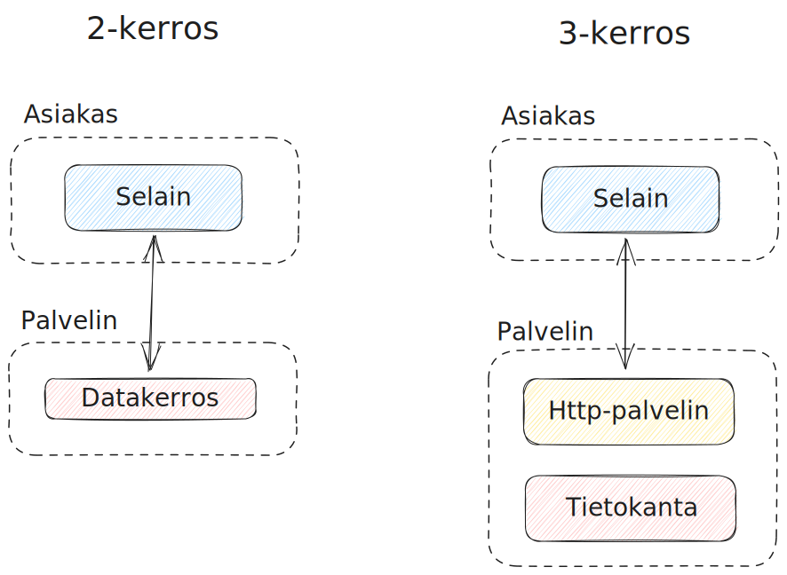
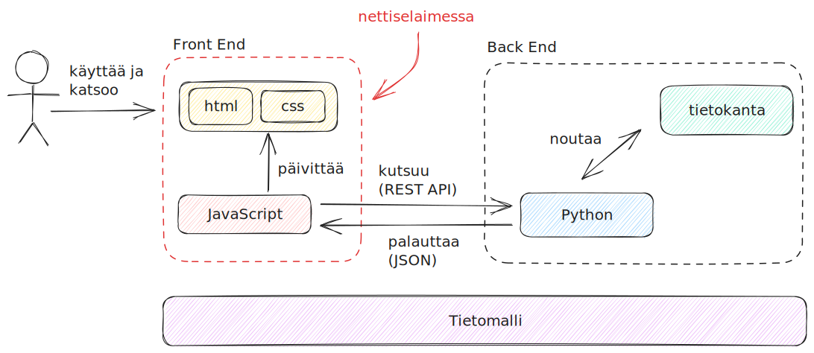
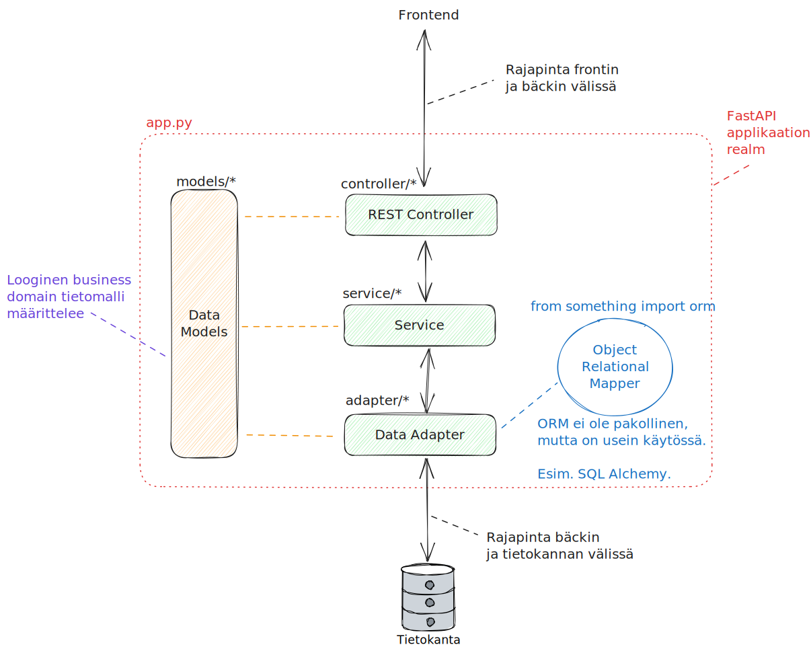

Tietoverkkojen malleihin on jo tutustuttu aiemmissa luvuissa, joten nyt on aika tutustua tietoverkkojen applikaatiokerroksella pyöriviin ohjelmistoihin: niiden rakenteeseen, ohjelmointikieliin, protokolliin. Heti alkuun on hyvä huomioida, että tietoliikenneohjelmointi ei juuri poikkea muusta ohjelmoinnista muuten, paitsi että ohjelmiston oletetaan hyödyntävän tietoverkkoa. TCP/IP-protokollaperhe on jo tällä kurssilla tullut tutuksi. Tyypillinen 2020-luvun applikaatio hyödyntää TCP/IP:tä (ja Ethernetiä) kahden tietokoneen väliseen kommunikaatioon.

## Ohjelmointikielet ja frameworkit

Tietokoneohjelmia voi luonnollisesti kirjoittaa useilla eri ohjelmointikielillä. Useissa ohjelmointikielissä on useita eri ohjelmistokehyksiä (eng. framework), jotka tarjoavat puitteet sekä valmiita työkaluja ja työskentelymalleja web-palvelun koodaamiseen. Stack Overflow mittaa kyselyissään eri ohjelmistojen arvostettavuutta. Arvostettuuden määritelmä on: "käyttäjistä %-osuus, jotka ovat käyttäneet samaa teknologiaa viimeisen vuoden aikana, ja haluavat jatkaa sen käyttämistä." Valitettavasti Stack Overflow anna mahdollisuutta rajata `n_people_must_have_experienced`-tyylisen dimension mukaan, joten alla on käsiteltynä data siten, että teknologiaa on pitänyt käyttää vähintään 3 000 vastaajaa, jotta se otetaan edes mukaan. Tämä tipauttaa esimerkiksi todella halutun ohjelmiston, Phoenixin, pois listalta, koska sitä on käyttänyt vain 1468 vastaajaa. Datan lähde on Stack Overflow -sivuston laatiman [Developer Survey 2023:n](https://survey.stackoverflow.co/2023/#section-admired-and-desired-web-frameworks-and-technologies) data, joka on ladattu [Googlen Kaggle](https://www.kaggle.com/datasets/stackoverflow/stack-overflow-2023-developers-survey?resource=download)-sivustolta.

| Tech         | Käyttäjää | ...joista käyttäisi uusiksi | ... prosentteina |
| :----------- | :-------: | :-------------------------: | :--------------: |
| Svelte       |   4753    |            3541             |        75        |
| ASP.NET CORE |   11896   |            8433             |        71        |
| Next.js      |   11972   |            7896             |        66        |
| Node.js      |   30626   |            19793            |        65        |
| FastAPI      |   5325    |            3434             |        64        |
| React        |   29137   |            18534            |        64        |
| Blazor       |   3501    |            2136             |        61        |
| NestJS       |   3681    |            2216             |        60        |
| Spring Boot  |   8583    |            5106             |        59        |
| Vue.js       |   11758   |            6804             |        58        |

!!! question "Tehtävä"
    Tutustu pintapuoleisesti ainakin yllä olevien sovellusten Top 5:een. Millä kielellä framework on toteutettu? Onko kyseessä palvelin- vai asiakaspuolen framework? Käy tutustumassa ja vertaamassa tätä W3Techs-sivuston kyselytuloksiin [palvelinpuolen ohjelmistokielistä](https://w3techs.com/technologies/overview/programming_language) sekä [asiakaspuolen ohjelmistokielistä](https://w3techs.com/technologies/overview/client_side_language) sekä [asiakaspuolen JavaScript-kirjastoista](https://w3techs.com/technologies/overview/javascript_library).

## Muta- ja pastavertaukset

Aivan kuten tietoliikenneverkot, myös ohjelmistot selitetään usein erilaisten abstraktioiden avulla. Ohjelmistolla on aina jokin arkkitehtuuri, halusit tai et. Pahimmillaan arkkitehtuuri on _big ball of mud_, parhaimmillaan arkkitehtuuri on valittu ohjelmistolle sopivaksi. Huomaathan, että yksikään arkkitehtuuri ei ole universaalisti paras. Arkkitehtuuri pitää valita käyttötapauksen mukaan.

Alla olevat lainaukset liittyvät termeihin Big Ball of Mud sekä Pasta Theory of Software. Tekstit ovat viihteellisiä, mutta antavat osviittaa siitä, mitä

> [Big Ball of Mud](http://www.laputan.org/mud/mud.html#BigBallOfMud) on epäjärjestelmällisesti rakennettu, rönsyilevä, huolimattomasti kyhätty, teipillä ja paikkalangalla koottu [spagetti-koodiviidakko](https://www.cs.brandeis.edu/~dkw/C-humor/pasta.txt). Olemme kaikki nähneet niitä. Nämä järjestelmät osoittavat sääntelemättömän kasvun merkkejä sekä toistuvaa, pikavoittoihin tähtäävää korjaamista. Tieto jaetaan siveettömästi järjestelmän etäisten osien välillä, usein siihen pisteeseen saakka, että lähes kaikki tärkeä tieto muuttuu globaalisti saatavaksi tai duplikoiduksi. Järjestelmän kokonaisrakenne ei välttämättä ole koskaan ollut hyvin määritelty. Jos oli, se saattaa olla haurastunut tunnistamattomaksi. Ohjelmoijat, joilla on edes ripaus arkkitehtonista harkintakykyä, välttelevät näitä liejuja. Vain ne, joita arkkitehtuuri ei huolestuta ja jotka ehkä tuntevat olonsa kotoisaksi päivittäisten reikien paikkaamisen hitaudessa näissä pettävissä padossa, tyytyvät työskentelemään tällaisissa järjestelmissä. --Brian Foote, Joseph Yoder (vapaa käännös)

Yllä olevan lainauksen spagetti-koodilinkin alta löytyy teksti, josta on osa käännetty suomeksi alla:

> Lasagne-koodia käytetään kuvaamaan ohjelmistoa, jolla on yksinkertainen, ymmärrettävä ja kerroksellinen rakenne. Vaikka lasagne-koodi on rakenteellinen, se on valitettavasti monoliittinen eikä helposti muokattavissa. Yritys muuttaa yhtä kerrosta käsitteellisesti yksinkertaista on usein käytännössä hyvin vaikeaa.
>
> Ihanteellinen ohjelmistorakenne koostuu komponenteista, jotka ovat pieniä ja löyhästi kytkettyjä; tätä ihanteellista rakennetta kutsutaan raviolikoodiksi. Raviolikoodissa jokainen komponentti tai objekti on paketti, joka sisältää jonkinlaisia täytteitä tai muuta ravintoa järjestelmälle; mikä tahansa komponentti voidaan muokata tai korvata ilman merkittävää vaikutusta muihin komponentteihin.

## Unitaarisesta kerrostettuun

Unitaarinen eli jakamaton arkkitehtuuri tarkoittaa sitä, että koko ohjelmisto pyörii yhdellä tietokoneella. Hyvin, hyvin kauan sitten historiassa tietokoneen olivat pakettiauton kokoisia mörköjä, joihin syötettiin reikäkortteja. Nämä olivat unitaarisia järjestelmiä. Myöhemmin näiden tietokoneiden pysyvä data (eng. persisted data) hajautettiin omaan järjestelmäänsä eli tietokantaan (eng. database). Myös käyttöliittymä hajautettiin. Reikäkorttilukijaa, näppäimistöä tai muuta syötelaitetta ei ollut enää pakko kiinnittää suoraan keskustietokoneeseen (eng. mainframe), vaan siihen pystyi muodostamaan yhteyden asiakaskoneella (eng. client). Tätä kutsutaan yleisesti ==asiakas-palvelinmalliksi== (eng. client-server model). Mallissa on nimensä mukaisesti kaksi kerrosta (asiakas ja palvelin), joten siitä voi käyttää yleisempää termiä 2-kerros (eng. two-tier) arkkitehtuuri. Ihminen, joka käyttää järjestelmää, on vuorovaikutuksissa asiakasohjelman kanssa eli ==front endin== kanssa. Taustalla toimiva palvelin on käyttäjältä piilossa, ja siitä voidaan käyttää termiä ==back end==.

Nyt, 2020-luvulla, unitaariset järjestelmät ovat ainakin tietokoneiden (ei-mikroaaltouunien) osalta poikeus. Ohjelmistot ovat lähes aina tavalla tai toisella kerrostettuja tai hajautettuja.

## N-tier



**Kuvio 1:** _Kaksi- ja kolmekerroksiset arkkitehtuurit rinnakkain. Case: HTTP._

Mikäli asiakas-palvelinmallin fronttia tai bäkkiä pilkkoo pienempiin vastuualueisiin, syntyy `n` kappaletta tasoja. Tarkka toteutus voi olla monenlainen, mutta kerrokset ovat yksi toisensa päällä, joten kokonaisuus on monoliittinen. Huomaa, että monoliittinen ei ole synonyymi unitaariselle. Unitaarisella sovelluksella on merkitävän suuri riski koitua mutapalloksi; kerrostetulla mutapalloksi kertymistä voi estää siten, että tarpeiden monimutkaistuessa purkaa erillisiä kerroksia yhä pienemmiksi kerroksiksi/moduuleiksi.

2-kerroksinen järjestelmä syntyy esimerkiksi siten, että datakerros on yksinkertainen Apache HTTP Server, tai verkkolevy, joka sisältää staattisen HTML-tiedoston`(index.html)`, joka viittaa tietokantamaisesti muihin saman palvelimen tiedostoihin `(meemi.gif, logo.gif, about.html)`. Vaihtoehtoisesti datakerros voi olla jonkin sortin tietokanta, josta asiakkaan selaimessa pyörivä JavaScript-sovellus hakee dataa.

3-kerroksinen järjestelmä pilkkoo toteutusta pienempiin osiin. Yllä olevan vertauksen mukaisesti lasagneen tulee siis uusia kerroksia. Tyypillinen esimerkki on irrottaa data omaan tietokantaan, jolloin HTTP-palvelin voi välittää ei-staattisia nettisivuja käyttäjälle, joiden sisältö, kuten blogipostaukset, tallennetaan tietokantaan. Bisneslogiikka on näin irrotettu datasta eli sisällöstä.

Tämän kurssin yhteydessä ei ole tarvetta käyttää aikaa pohtimiseen, että onko järjestelmä 2-, 3, 4- tai n-kerroksinen, jos `<kuvittele tähän hiuksia halkova poikkeusskenaario>`. Tämän kaltaiset teoreettiset, pieniä nyansseja arvottavat pohdinnat kuuluvat johonkin toiseen kontekstiin. Tärkeintä on tiedostaa, että on olemassa kerroksista koostuva arkkitehtuuri. Muista: lasagne!

## MVC

Yksi ilmentymä 3-kerroksisesta arkkitehtuurista on Model-View-Controller (MVC) pattern eli sapluuna. MVC:stä löytää helposti jopa aika kärkästäkin debatointia niin Stack Overflowsta, Redditistä kuin blogeiltakin. Tämän kurssin puitteissa riittää tietää, että 1990 luvun alussa Internet oli spagettikoodista koostuva kaaos, ja MVC oli yksi ratkaisu siihen, ja MVC perustuu itseään reilusti vanhempaan 3-kerrosarkkitehtuuriin. Lisäksi MVC:n perustermit on hyvä ymmärtää.

!!! question "Tehtävä"
    Etsi keskustelua, kommentointia tai väittelyä siitä, mikä MVC on tai ei ole. Voit kokeilla myös ChatGPT:tä, Bardia tai muuta LLM:ää.

Komponenttien Model, View ja Controller tehtävät ovat seuraavat:

- Model: Vastuussa liiketoimintaan liittyvän tiedon (eng. business domain) tilasta (eng. state.) Hakee tiedon tietokannasta (tai tiedostosta, tai rautakoodatuista muuttujista, tai generoi random dataa.) Model ei tiedä, kuinka applikaatio haluaa piirtää datan: se vain palauttaa sen.

* View: Vastuussa liiketoimintaan liittyvän tiedon presentaatiosta eli kuinka se näytetään katsojalle. View ei tiedä, kuinka ja mistä data on haettu. Se osaa vain piirtää sen, ja mahdollisesti sopeuttaa esimerkiksi eri näyttökooille.
* Controller: Vastuussa käyttäjän syötteen vastaanotosta ja käsittelystä. Kontrolleri on varsinainen liima Modelin ja View:n välissä.

Alla erittäin raakile Python-esimerkki. Jos et ole koodannut aiemmin, silmäile koodi läpi. Pythonin syntaksi tulee kurssin käytännön osiossa tutuksi, joten ei ole oletettua että ymmärrät koodin kokonaisuudessaan juuri nyt.

```python
class Model():
    def __init__(self):
        self.db = ImaginaryDatabase()
    def get_one(id):
        return self.db.get_one(id)
    def get_all(self):
        return self.db.get_all()

class View():
    def _render(self, model):
        return f"<p>{str(model)}</p>"

    def to_visual_format(self, model):
        return self._render(model)

class Controller():
    def __init__(self):
        self.model = Model()
        self.view = View()

    def get_one(self, id):
        return self.model.get_one()

    def get_all(self):
        return self.model.get_all()

###### BELOW THIS LINE IS THE CLIENT. #########
###### With web services, it would be #########
###### a browser/javascript messaging #########
###### over HTTP API.                 #########

class Client():
    # Instantiate
    controller = Controller()

    # Use
    one_row_by_id = controller.get_one(1)
    all_rows_from_db = controller.get_all()
```

## Käytännön esimerkki kerroksista

Tämän kurssin puitteissa kirjoitemme front end koodia (`HTML + CSS + JavaScript`) sekä back end koodia (esim. `Python`). Alla (Kuvio 2) on esitetty yhdenlaista tapaa kuvata valmiin tuotoksen arkkitehtuuria yleisesti. Huomaa, että tällä karkealle tasolla kuvattu kaavio ei ota kantaa JavaScriptin ja Pythonin sisällä pyöriviin moduuleihin. Kyseessä on hyvin karkea yleiskuva komponenteista. Yhteen graafiin ei edes kannata ympätä kaikkea: on näppärämpää piirtää tarpeen mukaan toinen graafi alle.

1. Arkkitehtuurin vasen puoli, front end, voi noudattaa MVC:tä.
2. Arkkitehtuurin oikea puoli, back end, voi noudattaa MVC:tä. Tästä on erillinen graafi alempana (Kuvio 3).

!!! question "Tehtävä"
    Selvitä, mitä hyötyä on kerrostamisesta ja/tai modularisoinnista. Tämä saattaa olla jo OSI-tietomallin sekä yllä olevan tekstin perusteella arvattavissa tai pääteltävissä, mutta käy silti lukemassa aiheesta lisää.

Kerrostetussa arkkitehtuurissa eri nuolien välillä on riippuvuus. Tämä riippuvuus on rajapinta eli interface, jota kummankin tulee noudattaa. Kunhan rajapinta pysyy samana, laatikon sisältöä voi muokata mielin määrin. Esimerkiksi front endin ja back endin välillä rajapintana on REST API, joka käyttää tavallisia HTTP-käskyjä. On täysin mahdollista vaihtaa Pythonilla koodattu back end vaikkapa Go:lla koodattuun back endiin. Sivuston toimivuus ei muutu. Koko REST API:n voi vaihtaa esimerkiksi Google Protobuffiin; tällöin JavaScriptin Model-päätyyn tulee tehdä muutoksia, koska `JS <--> Python`-rajapinta on vaihtunut REST API:sta Protobuffiin. Huomaathan, että tämä ei aiheuta muutoksia HTML- tai CSS-tiedostoihin tai Controlleri-osion logiikkaan. Kerrostamisen avulla ohjelmistoa voi siis modularisoida pieniin laatikoihin ja niiden välisiin rajapintoihin.



**Kuvio 2:** _Front ja back endistä koostuva WWW-sivu kaaviona. Looginen tietomalli on piirretty kuvan alle laatikkona; front endin sekä back endin pitää olla keskenään samaa mieltä siitä, mitä tietoa API:n läpi tulee ja missä formaatissa. Tämä on korostamassa, että `business domain` on laajempi käsite kuin yksi JavaScriptin tai Pythonin sisällä oleva Model. Sekä front että back joutuvat kuitenkin omalla kielellään määrittelemään tämän loogisen tietomallin toteutuksen esimerkiksi `models/`-nimisen hakemiston tiedostoihin._



**Kuvio 3:** _Ylemmän Kuvio 2:n oikea puolisko eli backend lähempää katseltuna. Musta vertikaalinen nuoli kuvastaa frontilta saapuvan kyselyn synnyttämien kutsujen kulkua tasojen läpi. Oranssit katkoviivat kuvastavat `from models import Thingy`-tyylisiä importteja. Sininen katkoviiva ja ympyrä ovat ORM._

Huomaa, että Kuvio 3:ssa näkyvän ORM:n (Object Relational Mapper) toiminallisuuden voi toteuttaa data adapterin sisään itse koodaamalla. ORM ei siis ole pakollinen. Se on lisätty graafiin, sillä se tulee merkittävän usein vastaan eri web frameworkien (esim. FastAPI) dokumentaatiossa ja esimerkeissä.

## Arkkitehtuurit ilman kerroksia

Entäpä tilanne, jossa arkkitehtuuri ei koostukaan kerroksista? Mitä jos se koostuu tavalla tai toisella ravioleista? Tällöin arkkitehtuuri ei ole ==monoliittinen== vaan ==hajautettu==. Yllä oleva, erillinen REST API -rajapintaa tarjoava palvelin on askel kohti tätä suuntaa. Nämä hajautetut arkkitehtuurit ovat pahasti tämän kurssin skoopin ulkopuolella, mutta niiden olemassaolosta on jo syytä olla tietoinen. Näitä ovat:

- Service-based architecture (SBA)
- Service-oriented architecture (SOA)
- Event-driven architecture (EDA)
- Microservices architecture (Microservices)

Huomaa, että nämä eivät ole huonompia tai parempi kuin kerroksista koostuvat arkkitehtuurit. Järjestelmälle asetetut vaatimukset ja järjestelmän monimutkaisuus määrittelevät, mikä arkkitehtuuri sopii millekin. Lopulta universaalia totuutta ei välttämättä edes ole, vaan arkkitehdin on pakko valita jotakin. Myöhemmin arkkitehtuuria voi refaktoroida, mutta se voi olla merkittävän kallista työmäärällisesti.

!!! question "Tehtävä"
    Lue lisää siitä, kuinka perinteinen Web 1.0:sta kehittyi eventtipohjaisten arkkitehtuurien koti: [A Technical Deep Dive on Event Driven Architectures](https://blog.quastor.org/p/tech-dive-event-driven-architectures-a55d)

!!! question "Tehtävä"
    Lue lisää siitä, ovatko monoliitit aina pahasta: [Death by a Thousand Microservices](https://renegadeotter.com/2023/09/10/death-by-a-thousand-microservices.html)
