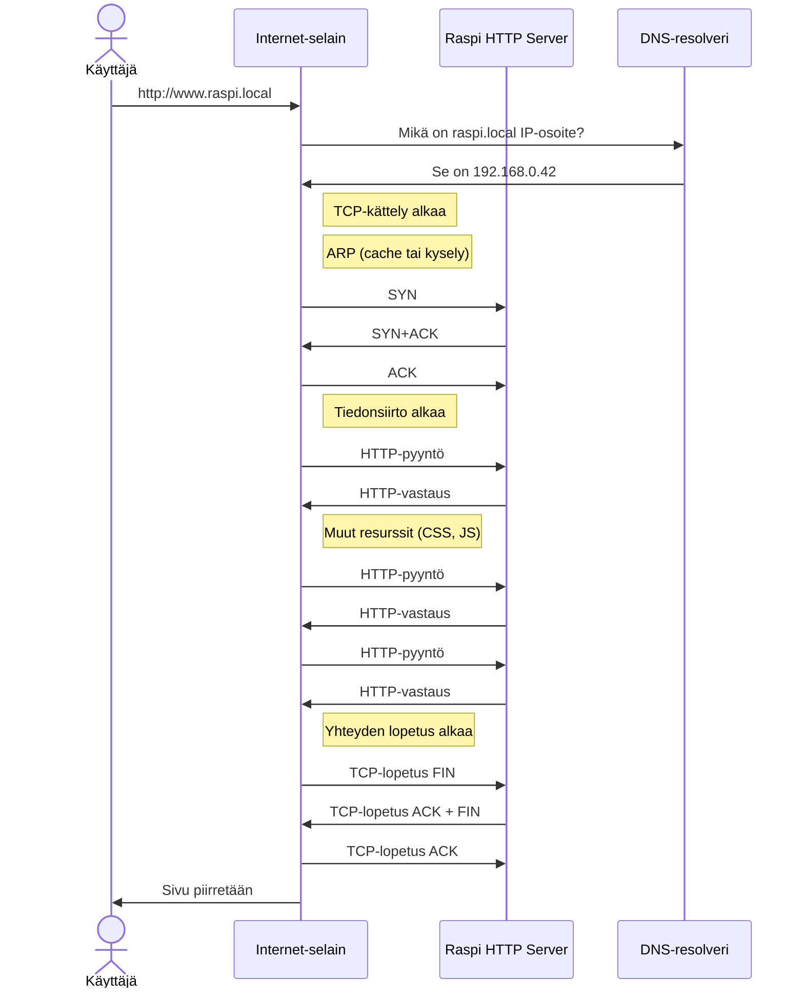
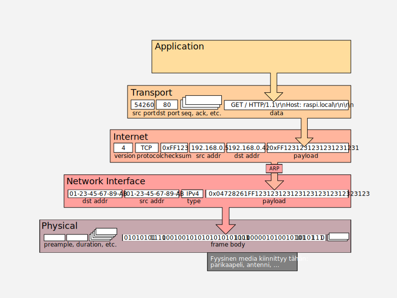
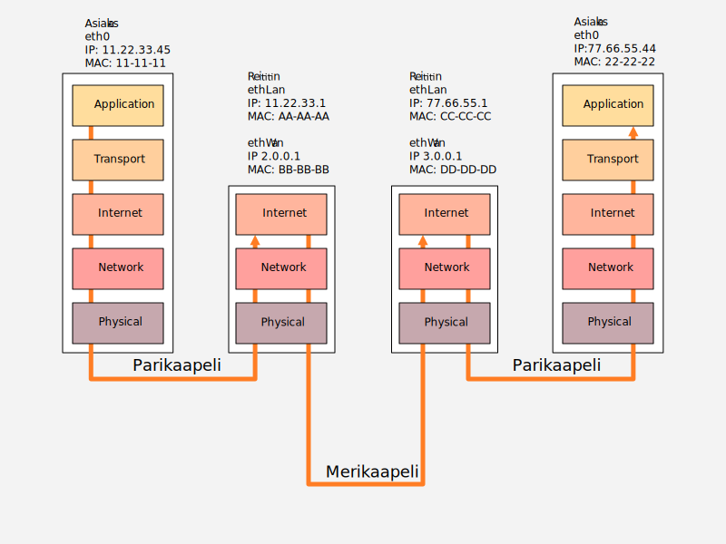

## Käyttäjä ja applikaatio

Kun käyttäjä kirjoittaa osoitekenttään `[http://]www.raspi.local`, selain päättelee halutun protokollan (HTTP) osoitekentän sisällöstä. Selain ei tiedä `raspi`:n IP-osoitetta, joten se kysyy tätä käyttöjärjestelmältä, joka käy katsomassa ensin `hosts`-tiedoston sisällön; mikäli tietoa ei löytynyt, se kysyy ensisijaiselta DNS-resolverilta vastausta.

Kun IP-osoite on tiedossa, on aika muodostaa yhteys, siirtää data, ja lopulta katkaista yhteys.



Mikäli HTTP-pyyntö olisi toteutettu Pythonilla,  ja se käyttäisi low-level `socket`-kirjastoa, koodi voisi näyttää jotakuinkin tältä:

```python
import socket

HOST = 'raspi.local'
PORT = 80

with socket.create_connection((HOST, PORT), timeout=5.0) as sock:
    sock.sendall(b"GET / HTTP/1.1\r\nHost: raspi.local\r\nConnection: close\r\n\r\n")
    
    while True:
        data = sock.recv(4096)

        if not data:
            break
```

Huomaa, että applikaation ei tarvitse huolehtia kättelyistä. Nämä tapahtuvat OSI-mallin (tai TCP/IP-pinon) alemmilla kerroksilla. Asiakas käyttää HTTP-protokollaa, kuten myös serveri, eli applikaatioiden välinen liikenne tapahtuu TCP/IP-mallin Application -kerroksessa. HTTP-protokolla ei ota kantaa siihen, kulkeeko signaali perille 2 metrin LAN-kaapelia, vai satelliittireittejä, ja onko välissä nolla, yksi vai kymmeniä reitittimiä. HTTP-protokollaa käyttävälle asiakasohjelmalle riittää, että yhteys muodostuu ongelmitta, ja paluupostissa tulee vastaus. Esimerkkivastaus alla:

```
HTTP/1.0 200 OK
Date: Sun, 13 Aug 2023 10:02:47 GMT
Server: WSGIServer/0.2 CPython/3.11.0
Content-Type: text/html
Content-Length: 22553

<!doctype (...paljon HTML-koodia...) </html>
```

Vaikka yllä käytetty socket on itsessään kohtalaisen low-level -kirjasto, siinä käytetty `create_connection`-funktio on abstraktio sen alla olevasta `socket.socket()` funktiosta. Mikäli haluat tutustua `create_connection`-funktion piilottamaan logiikkaan, katso Githubista kyseisen [CPython-funktion koodi](https://github.com/python/cpython/blob/main/Lib/socket.py). Socket-kirjasto on kokonaisuudessaan melko alhaisen tason luokka. Mikäli haluaa tiivistä koodia, voit käyttää huomattavasti abstraktimpaa `requests`-kirjastoa, joka pitää asentaa erikseen esimerkiksi komennolla `pip install requests`. Alla esimerkki requests-kirjastoa käyttäen:

```python
import requests

response = requests.get("http://raspi.local")
```

Kyllä, siinä on kaikki mitä tarvitsee osata käyttääkseen HTTP- ja TCP/IP-protokollaa käyttöjärjestelmässä, jota Python sockets tukee!


## TCP/IP kerros



**Kuvio 1:** *TCP/IP-protokollaperhe IEEE 802.x:n (Ethernet, Wireless Ethernet, ...) päälle toteutettuna. Malli noudattaa 5-kerroksista varianttia, jossa Hardware/Physical on mukana.*

Käyttöjärjestelmä, verkkokortin ajurit ja verkkokortin rauta piilottavat sisäänsä suuren osan tietoliikenteen monimutkaisuudesta. TCP/IP:n ylemmät kerrokset pysyvät muuttumattomina, oli varsinaisena siirtomedian protokollana Ethernet, Wireless Ethernet, PPP, MLPS tai muu. Vastaanottavan koneen päässä sama protokollapino suoritetaan päinvastaisessa järjestyksessä.


## Reititys



**Kuvio 2:** *Kahden tietokoneen välinen kommunikaatio reitittimien läpi. MAC-osoitteet lyhennetty 24-bittisiksi tiiviimmän ilmaisun toivossa.*

!!! question "Tehtävä"
    Yllä olevan esimerkin Raspberry Pi on kenties samassa verkossa asiakaskoneen kanssa, mutta entä jos ei ole? Katso yllä olevaa kuvaa ja pohdi, kuinka signaali kulkee verkosta toiseen. Tutustu vapaasti lähteisiin reitityksestä. Yksi suositeltu lähde on [Practical Networking: Networking Fundamentals](https://www.youtube.com/watch?v=bj-Yfakjllc&list=PLIFyRwBY_4bRLmKfP1KnZA6rZbRHtxmXi)-soittolista YouTubessa. Lesson 5 (Pt. I & II) käsittelee reititystä.