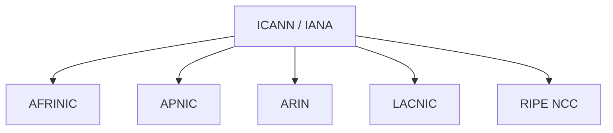

!!! quote
	Q: What do you get when you cross a mobster with an international standard?
    
	A: Someone who makes you an offer you can't understand
	
	--- Paul Mockapetris

## Globaalit (verkkojen) standardisointijärjestöt

Standardointijärjestöt vaikuttavat (ja ovatkin) byrokraattisilta organisaatioilta, mutta ilman yleisiä standardeja jokaisella eri yrityksellä olisi oma tapa toimia. Ilman standardeja meillä ei voisi olla Internetiä - tai ei ainakaan sellaisena kuin sen tunnemme. Järjestöjen keskinäiset kytkökset ovat monimutkaisia, ja standardin laatimiseen voi osallistua kerralla useampi eri järjestö. Alla esiteltynä lyhyesti muutama.

International Standards Organisation (ISO) on 1946 perustettu kansainvälinen järjestö, johon kuuluu jokaisesta jäsenvaltiosta yksi jäsenjärjestö. Suomen jäsen on SFS, Yhdysvaltain ANSI, ja Iso-Britannian on BSI. Kaiken kaikkiaan jäseniä on yli 150. Koko lista löytyy [ISO:n verkkosivuilta](https://www.iso.org/members.html). Standardit eivät ole määräyksiä vaan suosituksia. Valitettavasti standardit eivät ole apaasti Internetissä saatavissa, vaan pääsy niihin pitää lunastaa kaupan kautta. Yli 25 tuhannen standardin katalogiin mahtuu kaikenlaista, kuten A4 ja muut paperikoot (ISO 216), teen keittäminen (ISO 3103), laadunhallintajärjestelmä (ISO 9001), sekä tietenkin tällä kurssilla käsitelty OSI-malli (ISO/IEC 7498).

Kansainvälinen televiestintäliitto (International Telecommunication Union, ITU-T) ovat kaukana historiassa 1800-puolella lennättimissä. Nykyisin ITU-T toimii YK:n alaisuudessa ja siihen kuuluu  lähemmäs 200 jäsenvaltiota. Valtioiden lisäksi ITU-T:hen kuuluu toimialojen edustajia; Suomesta Nokia, Yhdysvalloista useita yrityksiä kuten Amazon, IBM, Netflix ja niin edelleen. Koko lista löytyy [ITU-T:n sivuilta](https://www.itu.int/hub/membership/our-members/directory/?myitu-industry=true&request=sector-members). Internetin kannalta merkittäviä standardeja ovat muun muassa H.264-videokoodekki sekä X.509 eli julkisiin avaimiin perustuva salaus.

Institute of Electrical and Electronics Engineers (IEEE) on kansainvälinen tekniikan alan ammatinharjoittajien - aivan valtava - yhdistys, jonka päätarkoitus on edistää teknologista innovaatiota ihmiskunnan eduksi. IEEE myy MAC-osoitelohkot niitä tarvitseville yrityksille. Yli 2000 standardin katalogista löytyy muun muassa 802.X-työryhmien standardeja, kuten IEEE 802.3-2022 (Ethernet) sekä IEEE 802.11-2020 (WLAN). IEEE:n standit käsittelevät myös muun muassa robotiikkaa, asioiden Internetiä (Internet of Things) sekä tekoälyä.

## Internetin-standardien järjestöt

Computer Networks -kirjan kirjoittaja tiivistää suurten standardiorganisaatioiden ja Internet-standardeja kehittävien vapaaehtoisjärjestöjen eroa alla olevan lainauksen tavoin, kenties hieman huumorimielessä.

!!! quote
	The difference can be crudely summed up by saying that the people who come to ITU or ISO standardization 
meetings wear suits, while the people who come to Internet standardization meetings wear jeans. -- Andrew Tanenbaum

Internet Engineering Task Force (IETF) kehittää muiden muassa Internet-standardeja, joista yksi on TPC/IP eli Internet Protocol Suite. IETF:n teknisiä dokumenttejä kutsutaan Request for Comments (RFC) -nimellä. Näihin lyhenteisiin on vaikea olla törmäämättä verkkoihin liittyvää dokumentaatiota ja kirjallisuutta lukiessa. Muutamia merkittäviä ovat Internet Protocol eli IPv4-protokolla (RFC 791), IPv6 (RFC 2460), TCP (RFC 793), UDP (RFC 768) ja HTTP/1.1 (RFC 9112).  Toisin kuin ISO:n standardit, joihin saa pääsyn luottokorttia näyttämällä, nämä ovat kaikki saatavilla ilmaiseksi - mistäpä muualta kuin - Internetistä.

Internet Research Task Force (IRTF) on IETF:n rinnakkainen järjestö, joka keskittyy lyhytaikaisten projektien ja toteutuksen sijasta pitkäaikaiseen tutkimukseen. Internet Architecture Board (IAB) sen sijaan tarkkailee näitä kahta.

Internetin infrastruktuurin omistaa suurilta osin kaupalliset toimijat, mutta niiden tulee noudattaa edellä mainittujen vapaaehtoisjärjestöjen luomia protokollia, mikäli haluavat että viesti kulkee Internetissä luotettavalla tavalla.

!!! question "Tehtävä"
	Etsi [IETF:n](https://www.ietf.org/) sivuilta RFC-haku tai -katalogi. Tutustu pintapuoleisesti dokumenttiin: RFC 9112. Kokeile etsiä myös muita standardeja kurssilla esiintyneiden termien tai lyhenteiden perusteella. Huomaathan, että haussa on Additional Criteria, jonka avulla voi suodattaa pois muut kuin nykyhetken standardit `Status:` => `Standards Track:` => `Internet Standard`. AIB:n, IEFT:n ja IRTF:n yläpuolella on Internet Society (ISOC), joka pyrkii edistämään Internetin avointa kehitystä sekä tukee ja edistää sen alaisuudessa toimivien tahojen toimintaa.

Internet Governance Forum (IGF) on Yhdistyneiden Kansakuntien vuonna 2006 kokoonpanema järjestö, joka nostaa esille Internetin sosiaalisia ongelmia, ja pyrkii näin edistämään tasa-arvoa, saatavuutta sekä Internetin kestävää ja turvallista käyttöä.

Muita yhdistyksiä ja järjestöjä on enemmän kuin tällä kurssilla tarvitsee luetella. Myös konsortioiden niiden suositukset voivat päätyä myös standardeiksi tai ainakin toimia niissä pohjana. W3C on (World Wide Web Consortium) on World Wide Webin (WWW) keksijän Tim Berners-Leen perustama yhteisö, joka kehittää avoimia standardeja tukemaan Internetin kasvua ja avoimmuutta. W3C:n visio kertoo paljon: "make the web work, for everyone" (elokuussa 2023.) W3C:n käytännöt käsittelevät muiden muassa HTML:ää, CSS:ää ja JavaScriptiä. Yksi mielenkiintoinen konsotio on Unicode Consortium, joka vastaa Unicode-merkistön kehittämisestä. Unicode-merkistö antaa ihmisten tuntemilla merkeille uniikin numeron, jolla ne voi tunnistaa. Lukaise esimerkiksi [tämä](https://unicode.org/wg2/docs/n5111-17442-squirrel-emoji.pdf) ehdotus, joka perustelee, miksi lähinnä Pohjois-Amerikassa esiintyvät tikutaku-emojin :chipmunk: (eng. chipmunk) rinnalle pitäisi lisätä meille tutumman näköinen orava.

## Internetin rekisteröinti- ja koordinaatiojärjestöt

Alunperin Internetin IP-numeroista ja domain-nimistä oli vastuussa Internet Assigned Numbers Authority (IANA), joka suuresta nimestään huolimatta oli käytännössä yksi henkilö.  DNS-rekisterin alkupisteenä on muistikirja, johon Jon Postel kirjasi ARPANET:n socket-numeroita. IANA oli Yhdysvaltain puolustusministeriön (DoD) valvovan silmän alla ja hallinnassa aina vuoteen 1998 asti, jolloin sen valvonta siirtyi tehtävää varten perustetulle järjestölle, joka tunnetaan nimellä ICANN (Internet Corporation for Assigned Names and Numbers). Vuonna 2016 IANA:n omistus siirrettiin kokonaisuudessaan ICANN:lle.

Heidän omien verkkosivujensa mukaan heidän tehtävät ovat seuraavat (suomeksi käännettyinä):

* ICANN ([lähde](https://www.icann.org/news/multimedia/1563)))
    * ICANN auttaa koordinoimaan internetin uniikkien tunnisteiden (IP-osoitteiden ja verkkotunnusten eli domain-nimien) sekä hallinnoi IETF:n protokollien parametrejä. 
* IANA ([lähde](https://www.iana.org/about))
    * Hallitsee nimipalvelimen (DNS) juurta (`.`), verkkotunnuksia `.int` ja `.arpa`, sekä non-latin (muut kuin `[A-Za-z]`) merkkejä sisältävien verkkotunnusten (Internationalized Domain Names, IDN) käytänteitä.
    * Koordinoi IP-osoiteavaruutta ja AS-numeroita (Autonomous System Number). IANA delegoi osoite-alueiden hallinnan alueellisille verkkotunnushallinnoille (Regional Internet Registry, RIR.)
    * Internet protocols’ numbering systems are managed in conjunction with standards bodies.
    * IP-protokollan numerointijärjestelmien (eng. numbering system) hallintaa (IP-numerointia, porttinumerointia).

Tahojen tehtävä on varmasti monimutkainen ja yllättävänkin vaikea kuvata ulkopuoliselle lyhyessä "About Us"-sivustossa. Tällä kurssilla ei ole tarpeellista edes yrittää syväluotaavati tutustua ICANN:n tai sen alaisuudessa olevien organisaatioiden päätöksenhallintaan. On kuitenkin hyvä tunnistaa organisaatioiden nimet ja osata yhdistää ne DNS:ään, verkkotunnusten rekisteröintiin, ja IP-osoitteisiin.

**Kuvio 1:** *ICANN/IANA:n alaiset alueelliset hallinnot.*

!!! question "Tehtävä"
	Alueelliset verkkotunnushallinnot eli Regional Internet Registryt (RIR:t) seuraavat hyvin karkeasti katsottuna maanosia, mutta merkittäviä poikkeuksia löytyy. Etsi internetistä ICANN:n RIR kartta ja tutki, millaisia eri hallintojen toimialueet ovat.

Jos kattojärjestöjen, ICANN:n ja IANA:n, tehtävät tuntuvat päällekäisiltä tai hatarasti määriteltyinä, niin RIPE NCC ei jätä paljon arvailuiden varaan heidän etusivujen tekstin perusteella: *"We distribute Internet number resources to our members and provide tools to help them manage their allocations and assignments."*. Keitä sitten ovat heidän jäsenet? Käy katsomassa RIPE NCC:n sivuilta kaikki Suomen alueelle rekisteröidyt [paikalliset rekisteröintitoimistot](https://www.ripe.net/membership/indices/FI.html) ja katso löydätkö yhtään tuttua yritystä - on aika yllättävää, jos et löydä!
