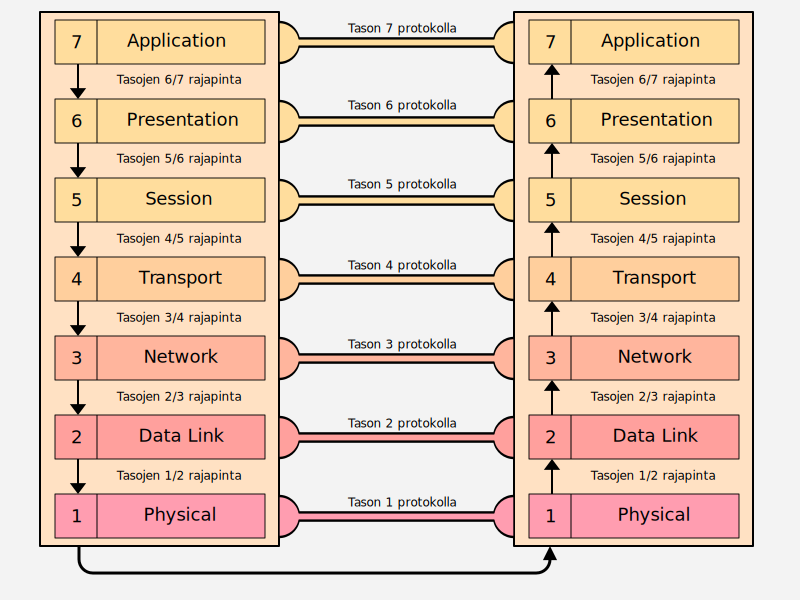

# OSI-malli

Jos avaat melkein minkä tahansa kirjan tietoverkoista, todennäköisyys törmätä termiin OSI on valtava. OSI-referenssimalli (Open Systems Interconnection Reference Model) on tapa mallintaa tai abstrahoida tietoverkkoja. OSI-malli ei suinkaan ole ainut tietoverkkoja kuvaava malli, ja myöhemmässä luvussa vertaamme sitä sekä TCP/IP-referenssimalliin että varsinaiseen TCP/IP-protokollaperheeseen.

OSI-mallin kerroksiin viitataan myös myös käytännön tuotteissa ja niiden dokumentaatiossa. Katso alla olevat lainaukset pilvipalveluntarjoajien AWS ja Azure dokumentaatioista.

!!! quote
    AWS Network Firewall complements existing network and application security services on AWS by providing control and visibility to Layer 3-7 network traffic for your entire VPC. --[AWS Network Firewall FAQs](https://aws.amazon.com/network-firewall/faqs/)

!!! quote
    Azure Load Balancer operates at layer 4 of the Open Systems Interconnection (OSI) model. --[What is Azure Load Balancer?](https://learn.microsoft.com/en-us/azure/load-balancer/load-balancer-overview)

OSI-malli julkaistiin 1980-alkuvaiheilla. Sen kirjoittajien, joihin lukeutuvat järjestöt ISO ja CCITT, ja sen tukijoiden, joihin lukeutuvat muun muassa teleoperaattorit :de: Deutsche Bundespost, :gb: British Telecom sekä :fr: France Telecom, tavoitteena oli luoda mallin pohjalta OSI-protokollaperhe (OSI protocol suite). OSI-protokollaperhe hävisi "protokollasodan" suurista tukijoista huolimatta. Internetin sydämessä sykkii TCP/IP-protokollaperhe; ei OSI-protokollaperhe. OSI-malli jäi kuitenkin elämään, kuten on nähtävissä muun muassa yllä olevissa lainauksissa.

## Mallin käyttö

Verkkotyöskentely (eng. networking) on merkittävän monimutkaista. Monimutkaisia ilmiöitä on järkevää yrittää jäsennellä pienempiin loogisiin kokonaisuuksiin. Samalla syntyy ammattisanastoa, joka antaa monimutkaisille ilmiöille sanan, jonka toisetkin alan ammattilaiset ymmärtävät. Tässä OSI-malli on avuksi. Mallit itsessään ovat teoreettisia pelkistyksiä eivätkä täten kykene täysin selittämään reaalimaailman toteutuksen kaikki nyansseja. 

!!! tip 
    Käytännössä jotkut tosimaailman protokollat ovat limbossa kahden eri tason välissä. Esimerkiksi MPLS on "Layer 2.5" protokolla. Kuinka monta sanaa tarvittaisiin selittämään sama asia, jos vastaanottaja ei tunne OSI-mallia tai sen tasoja?

    Protokollat eivät toteuta orjallisesti OSI-mallia tai mitään muutakaan abstraktiota, joten älä yritä turhaan survoa :orange_square:-muotoista palikkaa :orange_circle:-muotoiseen koloon.

[TCP/IP Guide](https://nostarch.com/tcpip.htm) -kirjan, jonka lukeminen on suositeltavaa, ehdotus on, että kysymykseen "Millä tasolla tämä laiteisto toimii?" kannattaa lisätä sana ==ylimmillään==. Esimerkiksi reititin toimii ylimmillään tasolla 3, mutta voi hyödyntää alempien tasojen rajapintoja. Yksittäinen protokolla voi istua hyvinkin yhdelle kerrokselle tai olla istumatta. Yleisesti protokollana tunnettu PPP on esimerkiksi aiemmin mainitun kirjan mukaan protokollaperhe (eng. protocol stack), joten jo protokollaperheen määritelmä ajaa siihen, että PPP toimii usealla kerroksella.

Tarinan opetus: koita käyttää OSI-mallia yksinkertaistamaan monimutkaista todellisuutta. Älä mieti liian tarkkaan yksityiskohtia.

## Kerrokset

Mikäli olet lukenut aiemmat luvut järjestyksessä, niin osaat jo odottaa, että jossain luvussa esitellään OSI-mallin 7 kerrosta. Ja nyt se tapahtuu!

**Kuvio 1:** *Kaksi rinnakkaista laitetta, joista vasen lähettää viestin oikealle OSI-mallin kuvauksen mukaan*

OSI-malli koostu seitsemästä tasosta tai kerroksesta. Kun informaatio kulkee horisontaalisesti, eli samalta tasolta samalle tasolle (yleensä eri tietokoneelle), niin kyseessä on **protokolla**. Kun informaatio kulkee vertikaalisesti, eli tasolta N tasolle N+1 tai N-1, niin kyseessä on **rajapinta** (eng. interface). Yllä oleva kuvio selventänee aiempia virkkeitä. Kuten aiemmissa luvuissa on todettu, alempi taso tuottaa ylemmälle tasolle palvelua. Alla kerrokset käydään läpi yksitellen, alkaen alimmasta eli konkreettisimmasta. 

!!! info 
	Alla esitellään suomenkieliset termit kerroksille ja niitä käytetään silloin kun se on luontevaa. Kuvioissa ja taulukoissa ovat käytössä englanninkieliset termit. Mallin sanastossa on hitusen väljyyttä jo muutenkin, joten sekaannusten välttämiseksi on turvallisempaa käyttää joko tason numeroa tai englanninkielistä numeroa. Taso ja kerros ovat alla synonyymejä.

# Tasot 1-4: Infrastruktuurikerrokset

### Taso 1: Physical

Alin taso on suomeksi fyysinen kerros, peruskerros tai siirtopiirikerros. Fyysisen kerroksen keskeinen tehtävä on siirtää bitit kommunikaatiokanavaan. Huomaa, että fyysinen kerros ei edusta kaapelia, vaan pikemminkin sitä rajapintaa, joka huolehtii että kaapeliin päätyy oikeanlainen signaali. Laitetasolla kerrosta yksi vastaavat modeemi ja keskitin eli hubi.

### Taso 2: Data Link

Toiseksi alin tas on suomeksi siirtokerros, siirtoyhteyskerros tai tietoyhteyskerros. Kerros vastaa datakehysten (eng. data frame) siirrosta kahden noodin, kuten tietokoneen, välillä. Kerroksen tehtäviä ovat muun muassa fyysisen osoitteiston (eli käytännössä MAC-osoitteiden) käsittely sekä ylemmiltä tasoilta saapuvien viestien pilkkominen sellaisiin palasiin, että vastaanottaja (eli keskustelukumppanin saman kerroksen sama protokolla) kykenee vastaanottamaan ne. Laitetasolla kerrosta vastaavat kytkin ja verkkokortit. Data link -kerros liittyy siis sellaisiin protokolliin, jossa koneet ovat tavalla tai toisella toisiinsa suoraan kytkettyinä yhteisen tiedonsiirtokanavan avulla. Tasolla toimivat protokollat käsittelevät alemman tason vikatilanteet, jotta ylempien ei tarvitse niistä murehtia.

# Tasot 3-4: Loogiset kerrokset

### Taso 3: Network

Kolmas kerros alhaalta on suomeksi verkkokerros tai verkkotaso. Huomaa, että tällä kerroksella verkko on looginen eikä fyysinen. Tällä tasolla toimivat reitittimet, jotka yhdistävät eri loogiset verkot toisiinsa, ja täten myös loogiset osoitteet. Kerroksen protokollat pakkaavat ylemmän kerroksen viestin paketeiksi. Mikäli ylhäältä tuleva viesti on liian suuri paketin (standardin määritelmän mukaan), niin data saatetaan fragmentoida useiksi pienemmiksi paketeiksi, ja vastaavasti kasata pienissä osissa saapuva paketti takaisin yhtenäiseksi kokonaisuudeksi. Tämän kerroksen protokollat huolehtivat myös viestikanavan ruuhkaisuudesta (eng. congestion) eli hillitsee pakettien lähettämistä alemmille kerroksilla mikäli paketeista alkaa muodostua ruuhkaa. 

### Taso 4: Transport

Neljäs kerros alhaalta on suomeksi kuljetuskerros. Tasojen kolme ja neljä välillä on todella vahva yhteys, mikä on huomattavissa muun muassa siitä, että protokollaperheitä nimetään näiden kahden kombinaationa (TCP/IP, IPX/IPX). Mikäli protokolla on kytkentäinen (eng. connection-oriented) kuten TCP, niin tämän kerroksen protokolla määrittelee, kuinka yhteys neuvotellaan auki, kuinka se pidetään auki, ja kuinka se katkaistaan. Mikäli protokolla on ei-kytkentäinen (eng. connectionless) kuten UDP, tätä ei tehdä.

Samaa fyysisestä (ja alemmilla tasoilla myös loogista) viestikanavaa käyttävät samaan aikaan useat eri applikaatiot, ja tämä kerros huolehtii viestin limityksestä tai kanavoinnista (eng. multiplexing) sekä kanavoinnin purkamisesta (eng. demultiplexing). Tilanne on hieman sama kuin digitaalisessa videostriimissä tai -tiedostossa, jossa yhteen bittivirtaan on upotettu yksi tai useampi kuvaraita, useita ääniraitoja ja tekstitykset. Jotta eri applikaatiot ja niille kuuluvat paketit voidaan jakaa oikeisiin laareihin, tarvitaan sovelluskohtainen tunniste. TCP/IP-protokollaperheessä tämä tunnetaan nimellä portti. IP-osoitteella tunnistetaan toisessa verkossa oleva tietokone; parilla IP + PORT tunnistetaan myös sovellus.

# Tasot 5-7: Applikaatiokerrokset

### Taso 5: Session

Viides kerros on suomeksi yhteysjaksokerros, yhteystapahtumakerros tai istuntokerros. Nimestä voi päätellä, että kerroksella huolehtitaan istunnoista (eng. sessions). Istunto yhdistää kaksi tietokonetta toisiinsa (loogisella tasolla), jotta ne voivat muodostaa keskenään yksittäistä viestiä pidemmän keskustelun. Samaan istuntoon liittyvillä viesteillä täytyy olla siis jokin tunniste. TCP/IP-protokollaperheessä vastaava istunto, tai sen ylemmille tasoille näkyvä rajapinta, on nimeltään TCP/IP Socket. Huomaa, että OSI-mallin istunto ei ole sama asia kuin verkkomaailmasta tuttu selainistunto, joka käyttää evästeitä eli keksejä (eng. cookies). Nuo istunnot on rakennettu vasta tason 7 yläpuolelle, esimerkiksi HTTP-rajapinnan päälle, eli sovelluksen omalle tontille. Tason 5 tarkoittama istunnon toteutus on paljon alemmalla tasolla; tietokoneen tapauksessa käyttöjärjestelmän kernelin uumenissa.

### Taso 6: Presentation

Toiseksi ylin kerros on suomeksi esityskerros tai esitystapakerros. Tämä kerros puuttuu datan presentaatioon, josta yksi esimerkki on merkistö (eng. character set). Tällä tasolla toimiva protokolla voi esimerkiksi kääntää windows-ympäristöstä tutut CRLF-rivinvaihdot UNIX-maailmasta tuttuihin LF-rivinvaihtoihin. Myös salaus voidaan hoitaa presentaatiokerroksella, kuten SSL:n yhteydessä, mutta toisaalta myös alemmat kerrokset voivat salata viestin (joka olisi tällöin tuplasti salattu.) Dataa voidaan myös kompressoida kuljetusta varten: esimerkiksi REST-rajapinnoissa käytetyt JSON-tiedostot voivat pienentyä merkittävästi, jolloin verkon IO-kuormaa siirretään CPU-kuormaksi (koska pakkaus syö CPU-aikaa.) Kaikki protokollat eivät välttämättä käytä tason 6 operaatioita laisinkaan, jos viestin formaatti on riittävän universaali eikä sitä tarvitse salata - tai se on salattu OSI-kerroksia hyödyntävän sovelluksen toimesta.

### Taso 7: Application

Ylin kerros on suomeksi sovelluskerros. Nimestä voi päätellä, että kerros liittyy tavalla tai toisella sovelluksiin eli ohjelmiin, mutta verkkoselain (Edge, Chrome, Firefox, ...), eli siis se C/C++:lla ohjelmoitu sovellus, ei ole osa kerrosta 7. Sen sijaan verkkoselain noudattaa protokollaa, jos se lähettää protokollan mukaisen kyselyn palvelimelle. Ei ole, mutta noudattaa.

# Tiivistävä taulukko

Muista, että OSI-malli on yleinen tietoverkkoja selittävä malli, joten se ei välttämättä selitä jokaista protokollaperhettä pienintä nyanssia myöden. Varsinkin kerrokset 5-7 voivat mennä melko vahvasti sekaisin. Seuraavissa luvuissa tutustumme yhteen tiettyyn protokollaperheeseen, eli TCP/IP:hen, joka tunnetaan myös nimellä Internet Protocol Suite. Alla taulukko, joka pyrkii tiivistämään yllä olevien otsakkeiden tekstin nopeasti silmäiltäväksi muistilistaksi.

| Kerros | Nimi         | Päätehtävä                                                                        |
| ------ | ------------ | --------------------------------------------------------------------------------- |
| 7      | Application  | Asiakasohjelman kutsuma kerros                                                    |
| 6      | Presentation | Salaus, pakkaus, merkistön vaihto.                                                |
| 5      | Session      | Istunnon ylläpitäminen.                                                           |
| 4      | Transport    | Viestit laareihin (eli portitus) sekä yhteydestä (jos protokolla on kytkentäinen) |
| 3      | Network      | Verkot jotka yhdistyvät toisiin verkkoihin (eli reititys)                         |
| 2      | Data Link    | Lokaalisti tavoitettavat verkot                                                   |
| 1      | Physical     | Bittien käsittely viestiksi                                                       |

 
