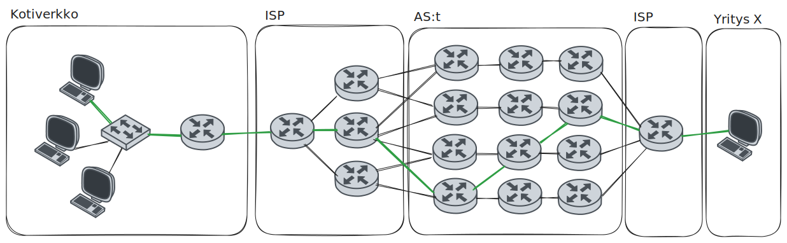

Mikäli IP-paketin kohteeksi merkattu IP-osoite ei ole lähettäjän kanssa samassa verkossa, tarvitaan reititin tai useita reittitimiä, joka tai jotka sitovat eri verkot yhteen. Lähettävä tietokone voi päätellä, onko kohdetietokone samassa verkossa katsomalla ip-osoitetta ja (ali)verkon peitettä. Katso alla olevaa Kuviota 1. Kuvitellaan, että kaikissa kuvion verkoissa aliverkon peite on 255.255.255.0. Kuvitellaan myös, että yksikään laite ei ole NAT:n takana. Jätetään myös TCP-portit huomioitta.

**Kuvio 1:** *Kahden tietokoneen välinen kommunikaatio reitittimien läpi, kuvitteellisen merikaapelin läpi. MAC-osoitteet lyhennetty 24-bittisiksi tiiviimmän ilmaisun toivossa. Kuvitellaan aliverkon peitteeksi kaikissa tapauksissa /24 eli 255.255.255.0*

Asiakas `10.0.1.11` (Kuvio 1:ssa) haluaa lähettää HTTP-pyynnön palvelimelle `10.0.3.22`. Hän on ehkä saanut tämän osoitteen DNS-palvelimelta, tai ehkä se on rautakoodattu sovellukseen.

## Vaiheittain

#### Vaihe 1

Asiakas laskee, kuuluuko kohdekone hänen kanssaan samaan verkkoon. `10.0.1.0/24` verkkoon kuuluvat osoitteet `10.0.1.0`-`10.0.1.255`, joten kone ei ole samassa verkossa. Tämä operaatio tapahtuu kerroksen Internet, johon kuuluvat IP-osoitteen, tasolla.

#### Vaihe 2

Asiakas lähettää paketin reitittimelle. Tämän tiedot hän on saanut joko rautakoodattuina tai DHCP-protokollan avulla saadessaan IP-osoitteen. Reitittimen osoite, eli default gateway, on tässä tapauksessa `11.0.1.1`. Henkilö, joka käyttää asiakastietokonetta, löytäisi tämän tiedon `ipconfig`-komennon avulla. Default gateway on, kuten sen on pakko olla, samassa verkossa asiakkaan kanssa. 

Siirrytään kerrokseen Network, tai tarkemminkin ARP-protokollaan, joka on liima kerrosten Internet ja Network välillä, eli IP- ja MAC-osoitteen toisiinsa liittävä protokolla. Asiakas tarkistaa omasta ARP-taulukostaan, mikä on kyseisen IP-osoitteen MAC-avain. Henkilö, joka käyttää asiakastietokonetta, löytäisi saman tiedon `arp -a`-komennon avulla. Mikäli taulukosta ei löydy tätä tietoa, eli taulukon tieto on vanhentunut, asiakas lähettää broadcast-osoitteeseen `255.255.255.255` eli fyyfiseltä osoitteeltaan `ff-ff-ff-ff-ff-ff` ARP-kyselyn. Kysely on kärjistäen `Hei kaikki, kuka teistä on 10.0.1.1 ?`. Reititin luonnollisesti vastaisi tähän kyselyyn, muut lähiverkon koneet eivät. Reititin ei välitä tätä kyselyä Internetiin: syntyisi kaaos, jos kaikki Internetin tietokoneet huhuilisivat ristiin.

Kun asiakaskone tietää reitittimen eli `10.0.1.1`:n MAC-osoitteen, joka on tässä esimerkissä helposti muistettava ja lyhennetty `aa-aa-aa`, se on valmis lähettämään paketin reittittimen MAC-osoitteeseen. Physical-tasolla tieto vaihdetaan ykkösiksi ja nolliksi eli biteiksi ja siirretään kohti mediaa, joka on tässä tapauksessa tavallinen parikaapeli.

#### Vaihe 3

Reititin vastaanottaa datansa parikaapelista. Physical taso työstää bittejä, Network-taso kasaa näistä Ethernet-kehyksiä, ja Internet-taso kasaa näistä IP-paketteja. Reititin lukee IP-paketin header-datasta kohdeosoitteen `destination ip`:n. Reitittimellä on oma [reititystaulu](https://en.wikipedia.org/wiki/Routing_table), joka olisi tässä tapauksessa jotakuinkin:

| Network     | Next Hop | Interface |
| ----------- | -------- | --------- |
| 10.0.1.0/24 | DIRECT   | ethLan    |
| 1.2.3.0/24  | DIRECT   | ethWan    |
| 10.0.3.0/24 | 1.2.3.5  | ethWan    |

Reititin näkee taulukosta, että kohdeosoite `10.0.3.22` on jossakin reitttimen `1.2.3.5` takana, joten IP-paketti sisältöineen pitää välittää reitittimelle `1.2.3.5`. Se katsoo kyseisen `.5`-reitittimen MAC-osoitteen ARP-taulusta, ja jos sitä ei löydy, suorittaa omassa lähiverkossaan eli `1.2.3.0` ARP-kyselyn. Kun lähetettävä IP-paketti saapuu reittimen Network-kerrokselle, siihen kiinnitetään `source MAC`:ksi laitteen oma eli `BB-BB-BB` ja kohteeksi eli `destination MAC`:ksi kohdereitittimen MAC eli `DD-DD-DD`. Ethernet-kehys siirtyy taas Physical-tasolle, jossa se käsitellään biteiksi.

#### Vaihe 4

Seuraava reititin saa datansa parikaapelista. Myös tämä reititin lukee IP-paketin header-datasta kohdeosoiteen eli `destination ip`. Kyseinen IP-osoite, `10.0.3.22`, kuuluu verkkoon `10.0.3.0/24`, johon on suora reitti ethLan-verkkosovittimesta.

| Network     | Next Hop | Interface |
| ----------- | -------- | --------- |
| 10.0.1.0/24 | 1.2.3.4  | ethWan    |
| 1.2.3.0/24  | DIRECT   | ethWan    |
| 10.0.3.0/24 | DIRECT   | ethLan    |

Paketin voi siis välittää perille MAC-osoitetta käyttäen. Reititin katsoo sen omasta ARP-taulustaan, ja mikäli sitä ei löydy, se suorittaa ARP-kyselyn. Kun lähetettävä IP-paketti saapuu reittimen Network-kerrokselle, siihen kiinnitetään `source MAC`:ksi laitteen oma MAC eli `DD-DD-DD`, ja kohteeksi eli `destination MAC`:ksi palvelimen MAC eli `22-22-22`. Data siirretään lähiverkossa perille.

#### Vaihe 5

Palvelin saa viestin ja se kulkeutuu Ethernet ja TCP/IP-protokollaperheen kerrosten läpi, kunnes saapuu lopulta (TCP-portin 80 avulla) HTTP-palvelimen käsiteltäväksi. IP-paketissa lukee yhä alkuperäinen lähettäjä eli `1.2.3.4`, joten palvelin tietää, kenelle vastaus pitää lähettää. Myös `source port` ja `destination port` ovat kulkeneet IP-paketissa jatkuvasti mukana. Vain MAC-osoitteisiin (ja hop counteriin) on puututtu matkan varrella.

!!! question "Tehtävä"
    Aihe on kohtalaisen monimutkainen ja sen parissa kannattaa viettää aikaa. Tutustu aiheisiin myös muiden lähteiden avulla. Yksi suositeltu lähde on [Practical Networking: Networking Fundamentals](https://www.youtube.com/watch?v=bj-Yfakjllc&list=PLIFyRwBY_4bRLmKfP1KnZA6rZbRHtxmXi)-soittolista YouTubessa. Lesson 5 (Pt. I & II) käsittelee reititystä.

!!! question "Tehtävä"
    Yllä olevassa esimerkissä jätettiin NAT käsittelemättä, vaikka lähiverkon ip-osoite `10.x.x.x` vaihtui julkiverkon IP-osoitteeksi `1.x.x.x`. Mikäli NAT tosiaan olisi käytössä, kuinka Internet-tason headereihin, varsinkin `source IP`:hen, olisi kajottu ja missä vaiheissa?

## Reititys todellisuudessa

Yllä olevan kaltaisia esimerkkejä katsoessa on hyvä muistaa, että ne ovat Internetiin verrattuna huomattavan yksinkertaisia verkkoja. Internetin taustalla toimiva verkko, Internet Backbone, on hierarkinen. Kannattaa kerrata IP-osoitteiden materiaali: vanha luokkiin perustunut IP-jako on 90-luvulla korvattu CIDR:llä, jossa ARPA hallinnoi koko Internet-osoiteavaruutta, ja delegoi siitä osioita RIR:ille, jotka delegoivat siitä osia suurille ISP:lle tai teknologiayrityksille, jotka delevoivat osia pienemmille toimijoille, ja niin edelleen. Lopulta jokin paikallinen ISP liisaa sinulle yhden tai useamman julkiverkon IP-osoitteen. Jos tämän rungosta haarautuvan rakenteen piirtäisi paperille, siitä syntyisi puuta muistuttava haarautuva verkko.

**Kuvio 2**: Osa internetistä kartoitettuna. Lähde: [The Opte Project - Originally from the English Wikipedia. CC BY 2.5](https://commons.wikimedia.org/w/index.php?curid=1538544). 

Yllä olevassa esimerkissä on tarkoituksella rikottu CIDR-periaatetta, jossa verkko pilkotaan pienempiin aliverkkoihin. Sen sijaan Kuvion 1 oikeanpuolisen reitittin takaa löytyy oudosti verkko `10.0.3.0/24`, joka ei ole verkon `1.2.3.0/24` aliverkko. Mikäli Internet toimisi oikeasti näin, reitittimien pitäisi muistaa uskomaton määrä verkkoja. Tämän sijasta Internetin runkona on AS:iä (Autonomous System), jotka ovat valtavia verkkoja, ja nämä ovat ristiin rastiin toisiinsa kytköksissä. Jokaisella AS:llä on omat reitityskäytännöt, ja AS:t viestivät näistä keskenään protokollan BGP avulla (Border Gateway Protocol). Lue AS:istä lisää esimerkiksi täältä: [What is an autonomous system? | What are ASNs? | Cloudflare](https://www.cloudflare.com/learning/network-layer/what-is-an-autonomous-system/). BGP-protokollasta löytyy lisää tietoa samalta sivustolta: [What is BGP? | BGP routing explained | Cloudflare](https://www.cloudflare.com/learning/security/glossary/what-is-bgp/).

**Kuvio 3**: *Yllä olevaa dummy-esimerkkiä todenmukaisempi kuvaus paketin kulusta (vihreä viiva) Internetin AS-verkkojen läpi. Huomaa, että jokainen yksittäinen paketti voi ajautua kulkemaan omaa reittiään.*

Lyhin reitti reitittimien läpi ratkaistaan, milläpä muulla kuin, protokollalla. Tämä protokolla on OSPF (Open Shortest Path First). Jotta mikään paketti ei jäisi pyörimään reittittimien väliin ikuiseen looppiin, jokainen paketti sisältää "hop countin", ja jokaisella paketilla on asetettuna maksimi hop count, jonka jälkeen se hylätään. Tämä toiminta noudattaa protkollaa RIP (Routing Information Protocol).

**Kuvio 4**: *Kuvitteellinen Internet, jossa IANA:an kuuluu vain kaikki RIR:iä, joista RIR1:lle kuuluu kaikki IP-osoitteet `0.0.0.0`-`127.255.255.255` ja RIR2:lle kaikki osoitteet `128.0.0.0` alkaen.* 

Emme tiedä, kuinka moneen aliverkon aliverkkoon (Kuvion 4) RIR1:een kuuluva AS1 on pilkottu. Meidän, kuten ei myöskään AS2:n reitttimen, ei tarvitse tietää tätä. AS1:n reittimet voivat hyvin ilmoittaa: *"Täältä löytyvät kaikki verkot 1.x.x.x"*. Näin AS2:n reititystaulun ei tarvitse sisältää jokaista aliverkkoa AS1:ssä, vaan sille riittää karkeimmalle mahdolliselle tasolle aggregoitu verkko-osoite: AS2:n reittitimet osaavat kyllä viedä paketin IP-osoitteen perusteella oikeaan aliverkkoon. Huomaathan, että Kuvion 4 esimerkissä AS:t on yksinkertaistettu siten, että niillä on vain yksi reititin.

Se, mikä pysyy vakiona esimerkin monimutkaisuudesta riippumatta, on että