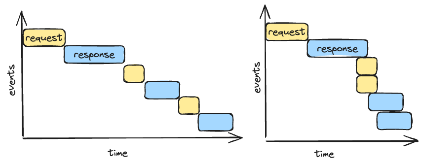

HTTP/1.1, joka sallii saman yhteyden käytön useisiin eri pyyntöihin, on ollut käytössä Internetin kannalta pitkään: 90-luvulta lopulta aina tähän päivään saakka. Näiden vuoden aikana on tapahtunut luonnollisesti muutoksia:

* Internet-yhteydet ovat nopeutuneet
* Sivut ovat kasvaneet kilotavuista megatavuihin
* Sivut ovat muuttuneet staattisista sivuista interaktiivisiksi web-applikaatioiksi

## Peräkkäisten kyselyiden viive

Olemme aiemmin kurssin aikana oppineet, että "GET / HTTP/1.1"-pyyntö palauttaa index.html-tiedoston. Internet-selain kuten Chrome tulkitsee tiedoston sisällön ja pyytää seuraavaksi ne tiedostot, joihin HTML-tiedostossa viitataan, kuten `style.css` sekä `main.js` sekä `kissa.jpg`. Tämä tarkoittaa, että selain lähettää palvelimelle useita pyyntöjä, joihin palvelin vastaa. Pyynnöt lähetetään yksi toisensa perään eikä rinnakkain. Mikäli pyyntöjä on satoja, ja viive on kymmeniä tai jopa satoja millisekunteja, sivuston lataus kestää luonnollisesti kauan. Viiveet kumuloituvat.

!!! warning

    Huomaa, että ongelmaa ei voi ratkaista nopeammalla (esim. 10 Mbps vs 1000 Mbps) Internet-yhteydellä. Kaistanleveyden kasvattaminen ei auta, koska ongelma on viiveessä, ei kaistanleveydessä.

Ongelman voi pyrkiä ratkaista monin muin tavoin, joihin lukeutuvat:

* Vähennä tiedostojen määrää.
    * Yhdistä useat CSS-tiedostot yhdeksi.
    * Bundlaa useiden eri JS-tiedostojen koodi suoraan HTML-tiedostoon. (webpack)
    * Bundlaa useat kuvat yhdeksi isommaksi kuvaksi ja leikkele koodissa. (sprites)
* Paginoi
    * Lataa vain vähän kontenttia kerrallaan, ja loput myöhemmin kun käyttäjä selaa alaspäin tai klikkaa next.
* Pipelining 
    * Ks. [Wikipedia: Pipelining](https://en.wikipedia.org/wiki/HTTP_pipelining)
    * Teoriassa hyvä ratkaisu, mutta käytännössä jäänyt käyttämättä.
* Useat HTTP-yhteydet
    * Hae kuvat images.domain.com subdomainista. (sharding)
    * Haittana TCP- ja HTTPS-kättelyitä joudutaan tekemään useita.

**Kuvio 1**: *Äärimmäisen kärjistetty HTTP/1.1:n ero ilman Pipelining ominaisuutta ja sen kanssa.*

## HTTP/2 ratkaisut

Yllä esitellyt kikat paikata HTTP/1.1:n tehottomuutta toimivat jossakin määrin, mutta HTTP/2 tarjoaa kestävämpiä ratkaisuja. Itse standardi löytyy IETF:n sivuilta: [RFC 7540](https://datatracker.ietf.org/doc/html/rfc7540)

!!! warning

    Huomaa, että HTTP/2 toimii vain ja ainoastaan HTTPS:n kanssa, ei koskaan HTTP:n kanssa. Yksikään osoite, joka alkaa `http://` ei koskaan käytä HTTP/2:sta.

HTTP/2:n tärkeimmät ominaisuudet ovat:

* Header compression (HPACK)
    * Header pienenee, joten siirrettävän datan määrä vähenee.
* Multiplexing
    * Useat viestit limitetään yhteen viestikanavaan. Ks. [Wikipedia: Multipleksaus](https://fi.wikipedia.org/wiki/Multipleksaus)
* Pyyntöjen priorisointi
    * Limitettäville viesteille voidaan asettaa priorittiarvo (weight), joka määrittelee, missä järjestyksessä ne tulee prosessoida.
* Server Push
    * Palvelin voi lähettää dataa ilman että asiakas pyytää sitä. Katso esimerkki: [Medium: HTTP/2 Server Push tutorial](https://medium.com/@mena.meseha/http-2-server-push-tutorial-d8714154ef9a)

!!! question "Tehtävä"

    Avaa incognito-ikkuna ja käy alla olevissa osoitteissa. Vertaile latausaikojen eroja:

    * [HTTP://www.httpvshttps.com](http://www.httpvshttps.com/)
    * [HTTPS://www.httpvshttps.com](https://www.httpvshttps.com/)

    Koeasetelma on hyvinkin kärjistetty, mutta se havainnollistaa hyvin HTTP/2:n ja HTTP/1.1:n eroja. Muista tutkia myös Network-välilehteä Developer Toolsien avulla.

!!! tip

    Jos haluat kokeilla Chrome-selainta ilman HTTP/2-tukea, luo pikakuvake, joka käynnistää sen `--disable-http2`-flagilla tai käynnistä se komentokehotteen kautta `chrome --disable-http2`. Tämä mahdollistaa Developer Toolsien Network-välilehdellä HTTP/2:n ja HTTP/1.1:n erovavaisuuksien vertailun. Muistathan tuhota cachet. Incognito saattaa auttaa.
