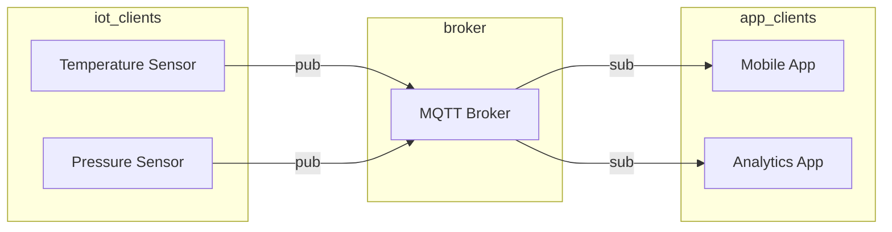

MQTT (Message Queuing Telemetry Transport) on laitteiden väliseen viestintään tarkoitettu protokolla. MQTT on tarkoitettu tilanteisiin, joissa laitteiden tulee olla yhteydessä toisiinsa, mutta laitteiden resurssit ovat rajalliset. Tällaisia tilanteita ovat esimerkiksi anturit, joissa on vain vähän muistia ja laskentatehoa. Protokolla on usein käytössä erilaisten IoT (Internet of Things) ratkaisuiden kanssa. Toisin kuin valtaosa muista kurssin protokollista, MQTT on ==publish-subscribe== arkkitehtuurin mukainen, mikä käytännössä tarkoittaa sitä, että clientin ja serverin sijasta peliin astuu broker eli viestinvälittäjä.

Yksittäinen viestijä voi toteuttaa sekä publish että subscribe rooleja.



!!! warning

    Käytännön tasolla tilanne ei ole aina yhtä yksinkertainen kuin yllä olevassa diagrammissa. IoT-asiakakkaiden ja brokerin välissä voi olla esimerkiksi erillinen MQTT Gateway.

## Topics

MQTT:ssä viestit julkaistaan (publish) topicciin ja niitä luetaan (subscribe) topicista. Topic on hierarkinen ja muistuttaa hieman kansiorakennatta. Yksittäinen client voi kirjoittaa ja/tai lukea yhteen tai useampaan topiciin. Alla esimerkki:

```
# Tuottajat
TEMPERATURE_SENSOR ==> /home/livingroom/temperature
PRESSURE_SENSOR ==> /home/livingroom/pressure

# Yhden topicin kuluttajat
/home/livingroom/temperature ==> TERMOSTAT_CONTROLLER
/home/livingroom/pressure ==> PRESSURE_CONTROLLER

# Kaikkien topicin kuluttaja
/home/livingroom/temperature ==> ANALYTICS_APP
/home/livingroom/pressure ==> ANALYTICS_APP
```

!!! question "Tehtävä"

    Tutustu myös muihin publish-subscribe ratkaisuihin pintapuoleisesti. Voit käyttää tutustumiseen esimerkiksi valitsemasi hakukoneen kuvapohjaista hakua. Muita ratkaisuita ovat esimerkiksi:

    * Apache Kafka
        * Käyttää termejä "producer" ja "consumer".
    * RabbitMQ
        * Käyttää termiä "queue" topicin sijaan.
    * Amazon SNS
    * Google Cloud Pub/Sub
    * Redis Pub/Sub
        * Käyttää termiä "channel" topicin sijaan.

!!! question "Tehtävä"

    Tutustu MQTT-viestin sisältöön tarkemmin: [Understanding an MQTT Packet: Ultimate Guide](https://cedalo.com/blog/mqtt-packet-guide/)

## Client

MQTT:stä löytyy kaksi eri OSI Layer 4 variaatiota:

* MQTT
    * Käyttää TCP:tä
* MQTT-SN (MQTT for Sensor Networks)
    * Käyttää UDP:tä

Yksi Python-toteutus on [paho-mqtt](https://pypi.org/project/paho-mqtt/). Sen käyttöön löytyy dokumentaatiosta ohjeita, joista alla hyvin tiivis esimerkki:

```python
mqttc.connect("mqtt.eclipseprojects.io")
mqttc.loop_start()

while True:
    temperature = sensor.blocking_read()
    mqttc.publish("paho/temperature", temperature)
```

!!! tip

    Yksi monista MQTT(-SN) asiakasohjelmista on Paho. Käy tutustumassa [Eclipse Foundationin Paho-sivustoon](https://eclipse.dev/paho/).

## Broker

MQTT brokereita löytyy myös useita, joista valita. Alla esimerkkejä:

* [Mosquitto](https://mosquitto.org/)
* [HiveMQ](https://www.hivemq.com/)

MQTT-pohjaisia IoT-ratkaisuja tarjoavat myös useat pilvipalveluntarjoajat ja muut toimijat. Alla esimerkkejä:

* [AWS IoT Core](https://docs.aws.amazon.com/iot/latest/developerguide/what-is-aws-iot.html)
* [Microsoft Azure IoT Hub](https://azure.microsoft.com/en-us/services/iot-hub/)
* [CloudMQTT](https://www.cloudmqtt.com/)
