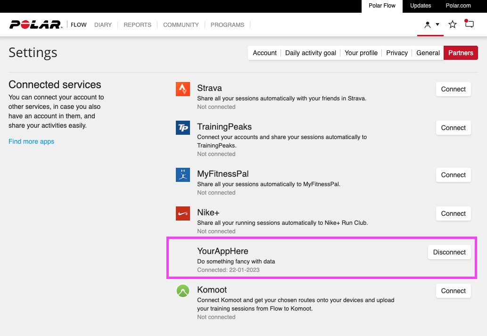

Webhook ei ole varsinainen protokolla vaan REST API:n avulla toteutettu keino suorittaa callback-ilmoituksia. Webhookin avulla voidaan toteuttaa esimerkiksi seuraavanlaisia toiminnallisuuksia. Alla olevassa esimerkissä X on sinun pyörittämäsi palvelin, ja Z on jokin kolmas osapuoli, jolta sinä haluat saada ilmoituksia.

* Lähetä ilmoitus X:lle, kun uusi asiakas on rekisteröitynyt Z:lle.
* Lähetä ilmoitus X:lle, kun Z-palvelun git-repositorioon on tehty uusi commit.
* Lähetä ilmoitus X:lle, kun Z-palvelun tietokantaan on lisätty uusi rivi.

Kyseessä on siis hyvin tyypillinen "callback function", joka tulee tällä kurssilla tutuksi ainakin JavaScriptin osalta. JavaScriptissä vastaava toiminnallisuus toteutetaan näin:

```javascript
function callbackFunction() {
    // Tee jotain
}

const button = document.querySelector('#button');
button.addEventListener('click', callbackFunction);
```

Huomaa, että jatkossa callbackFunction suoritetaan aina kun event `click` tapahtuu.

## Webhookin rekisteröinti

Jotta voit rekisteröidä webhookin haluamaasi palveluun (yllä `Z`), täytyy kyseisen palvelun toteuttaa jokin rajapinta, jossa voit kertoa käytännön tasolla jotakin tällaista:

> Aina kun {{ tapahtuma_a }} tapahtuu, lähetä HTTP POST osoitteeseen www.saitti.fi/webhook.

Sinun palvelusi (yllä `X`) sekä Z-palvelu kommunikoivat siis HTTP POST -pyyntöjen avulla. Kyseessä on aivan tavallinen REST API -pyyntö. Jotta sinun palvelusi voi ymmärtää palvelun Z lähettämän viestin, tulee sinun palvelusi tietää viestin skeema. Webhook ei ole standardi ja vielä vähemmän standardi on sen sisältämä payload. Jokainen palvelu voi toteuttaa webhookin omalla tavallaan. Esimerkiksi GitHubin webhookin skeema on erilainen kuin GitLabin webhookin skeema. Skeema selviää aina ==palvelun dokumentaatiosta==.

## Case: Polar Flow

Polar Flow on Polar Oy:n kehittämä sovellus, joka toimii yhdessä Polar-urheilukellojen kanssa. Polar Flow -sovelluksen avulla käyttäjä voi seurata harjoitteluaan, analysoida harjoitteluaan, ja jakaa harjoitteluaan muiden käyttäjien kanssa.

> "Polar Accesslink webhooks allows client application to subscribe to receive notification when certain event occurs." Lähde:[Accesslink API v3 docs: Accesslink Webhooks](https://www.polar.com/accesslink-api/#accesslink-webhooks)

Ohjelmistonkehittäjät voivat kehittää omia sovelluksia, jotka hyödyntävät Polar Flow:n dataa heidän suostumustensa mukaisesti. Katso Polarin sivuilta esimerkkejä: [Polar: Compabtible Apps](https://www.polar.com/en/compatible-apps). Voit luoda oman applikaatiosi, mikäli haluat.



**Kuvio 1:** *Polar Flow -sivuston näkymä, jossa näkyy asiakkaan aktivoimat Partner palvelut. YourAppHere voisi olla esimerkiksi täysin henkilökohtaiseen käyttöön luotu palvelu, jolla on tasan 1 käyttäjä eli sinä itse - tai kenties sovellus, jolla sinä teet miljoonasi.*


!!! tip

    Mikäli haluat **oikeasti** rekisteröidä oman palvelusi, sinun tulisi luoda Polar Accesslink Client. Lue tätä varten ihan dokumentaation alusta How to get started? -osio. Seuraavissa esimerkeissä oletetaan, että Client on luotu ja BasicAuth tai Oauth2-autentikaatio on hoidossa. HTTP headereista löytyy siis autentikaatioon tarvittavat tiedot.

    Tämän toteuttaminen ei ole kurssin vaatimus.


### Webhookin rekisteröinti

Kuten [dokumentaatiosta](https://www.polar.com/accesslink-api/#create-webhook) selviää, webhookin luomista varten on oma endpoint: `POST /v3/webhooks`. Sinun tulee lähettää HTTP-viesti verbillä POST kyseiseen endpointtiin. Viestin sisältämä data (POST-viestin body) on muotoa:

```json
{
  "events": [
    "EXERCISE"
  ],
  "url": "https://myapp.example.com/acl_webhook"
}
```

Viestin lähettäminen vaatii Basic -autentikaation eli pseudokoodina `b64encode(client_id + ":" + client_secret)` lähettäminen HTTP-pyynnön headerissa.

### Webhookin payload

Kun sinun Polar Accesslink Clientisi on rekisteröinyt webhookin Polar Flow -palveluun, Polar Flow lähettää sinun palveluusi POST-viestin, kun jokin rekisteröidyistä tapahtumista tapahtuu. Yllä rekisteröitiin event `EXERCISE`, joten Polar Accesslink kutsuu sinun `/acl_webhook` endpointtia aina kun sinun API Clientin asiakas on synkannut eventin `EXERCISE` eli treeni Polar Flow -sovelluksessa. HTTP-pyyntö on verbiltään POST ja sen body on muotoa:

```json
{
  "event": "EXERCISE",
  "user_id": 475,
  "entity_id": "aQlC83",
  "timestamp": "2018-05-15T14:22:24Z",
  "url": "https://www.polaraccesslink.com/v3/exercises/aQlC83"
}
```

Sinun palvelusi voi reagoida tähän webhookiin esimerkiksi siten, että:

* Palvelusi käy lukemassa `payload["url"]` osoiteesta dataa.
    * Tähän tarvitset `user_id==475` luvan.
    * Lupa annetaan Oauth2-autentikaation avulla palvelusi ja Polar Accesslink Clientin välillä.
    * Datan skeema löytyy [Get exercise](https://www.polar.com/accesslink-api/#get-exercise)-endpointin dokumentaatiosta.
* Datan perusteella palvelusi päivittää tietokantaansa.
* Asiakkaalle lähetetään viesti, että palvelusta löytyy uutta tietoa (esim. Push Notification)

Mitä tästä lopulta hyötyy? Hyöty on, että jatkuvan pollaamisen sijasta Polar kertoo sinulle, kun uutta dataa on saatavilla. Voit luoda kohtalaisen reaaliaikaisen Partner-connectionin ilman että ammut jatkuvalla syötöllä "Onko uutta dataa?"-kyselyitä eri endpointteihin.
