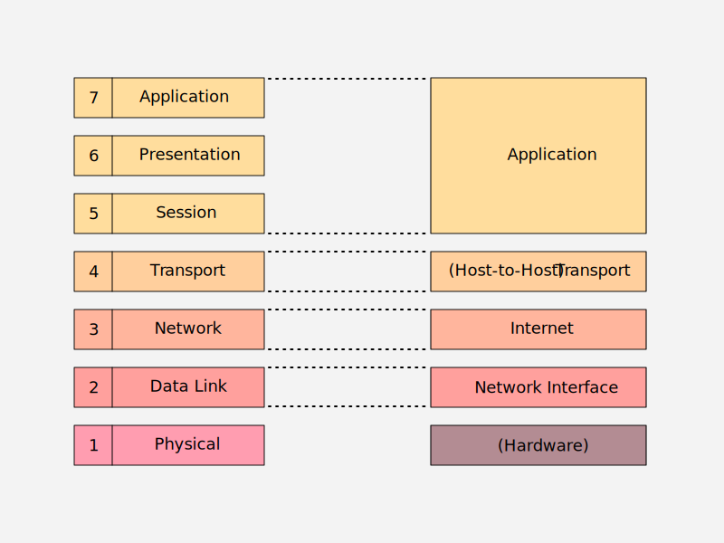

# TCP/IP Reference Model

Yleiskäyttöinen OSI-malli on tullut tutuksi aiemmissa luvuissa, joten nyt on aika siirtyä tutkimaan lähes rinnaikaiseen aikaan syntynyttä toista referenssimallia, **TCP/IP Reference Modelia**. Kyseinen malli ei ole pelkästään teoreettinen malli, vaan jokseenkin mallin mukainen käytännön toteutus, eli TCP/IP-protokollaperhe, toiselta nimeltään Internet Procotol Suite, on koko Internetin tekninen peruspilari. Vielä 90-luvulla ylemmillä mallin kerroksilla oli joitakin kilpailevia protokollia, kuten NetBIOX, IPX/SPX ja AppleTalk, mutta TCP/IP on dominoinut toteutuksia siinä määrin, että Internetin historia ja TCP/IP-protokollaperheen historia kulkevat hyvinkin käsi kädessä. IPX/SPX:ää on esiintynyt kuitenkin yllättävänkin lähihistoriassa. Esimerkiksi Red Alert -reaaliaikastrategia tuki lähiverkossa vain IPX/SPX-ajureita, mikä tarkoittaa että pelaajan piti asentaa ja aktivoida kyseinen ajuri Windowsin Ohjauspaneelista.

OSI on ISO-standardointijärjestön malli, kun taas TCP/IP Reference Model on Yhdysvaltain puolustusministeriön (U.S. Department of Defence, DoD) ARPAnet:n (Advanced Research Projects Agency Network) arkkitehtuuria selittänyt malli. ARPAnet oli pakettivälitteinen WAN-verkko, jonka kuljetuskerroksen (Transport) protokollana oli 1970-luvulla NCP, ja vuoden 1983 alkaen TCP/IP-protokolla. Huomaa, että käytössä ollut TCP/IP kehitettiin ennen OSI-mallia, joten sen keksijät eivät selittäneet TCP/IP-protokollia OSI-mallin avulla. Siitä huolimatta TCP/IP:tä voidaan kuvata - ja usein kuvataankin - nimenomaan OSI-mallin avulla. 

!!! note
    TCP/IP-protokolla(perhe) on siis käytännön toteutus, jonka alkuperäinen abstraktio on TCP/IP-referenssimalli, mutta jota usein nykyään selitetään OSI-mallin avulla.

## OSI-malli vs. TCP/IP-malli

**Figure 1:** *OSI-mallin ja TCP/IP-referenssimallin kerrosten vastaavuudet vertailu*

Alla tiivis kuvaus kunkin TCP/IP-mallin kerroksen käytännön toteutuksesta TCP/IP-protokollaperheessä. Huomaat, että niiden toiminta pätee yllättävänkin hyvin OSI-mallin kuvaukseen eri kerroksista, mutta ylimmän tason applikaatiokerrokset on puristettu yhteen isoon Application-kerrokseen ilman erillistä istunto- tai esityskerrosta. 

* ~~Hardware~~
    * :warning: Alkuperäinen TCP/IP-referenssimalli ei käsittele fyysistä kerrosta laisinkaan, mutta se on mukana myöhemmissä mallin varianteissa, kuten Tanenbaumin Computer Networks -kirjan esittelemässä mallissa. :warning:
* Network Interface
    * TCP/IP-referenssimallin käytännön toteutukset eivät monissa tapauksissa käytä ainuttakaan TCP/IP-protokollaa, joka kuuluisi OSI-mallin tasolle 2 eli TCP/IP-mallin Network Interfaceen. Tämä johtuu siitä, että useimmiten TCP/IP-protokollat on rakennettu Ethernet-kerrosten tarjoaman abstraktion päälle, ja Ethernet vastaa OSI-kerrosten 1 ja 2 toiminnasta. Poikkeuksena on tilanteet, joissa Internet-kerros hyödyntää PPP tai SLIP-protokollaa; tämä on tilanne esimerkiksi 56 kbps modeemia käyttäessä. ARP-protokolla, joka suorittaa mappausta MAC-osoitteiden ja IP-osoitteiden välillä, pyörii tavallaan kerroksella kaksi, mutta sen voi nähdä myös pyörivän jossain kerrosten 2 ja 3 oudossa välitilassa.
* Internet
    * Internet-kerroksen tunnetuin protokolla on jo TCP/IP:n nimestä tuttu IP-protokolla (Internet Protocol), ja samalla kerroksella on toteutettu sekä IPv4 että IPv6. Reititys tapahtuu tason kolme protokollien avulla, IP-osoitetta käyttäen, ja näitä reititysprotokollia ovat muun muassa OSPF, BGP ja RIP. Myös kurssilla mainittu NAT on tämän kerroksen TCP/IP-protokolla.
* Transport
    * Kuljetuskerroksella toimivat kytkentäinen (eng. connection oriented) TCP-protokolla sekä ei-kytkentäinen UDP-protokolla.
* Application
    * TCP/IP-malli sitoo koko sovellusrajapinnan yhteen kerrokseen toisin kuin OSI-malli, jossa sovelluskerros on hieman epämääräinen sotku. Tällä kerroksella pyörivät useat käyttäjille sovelluksista tutut protokollat kuten HTTP, FTP, SMTP, Telnet ja IRC sekä useille käyttäjille kotimodeemin asetuksista tutut protokollat DHCP sekä DNS.