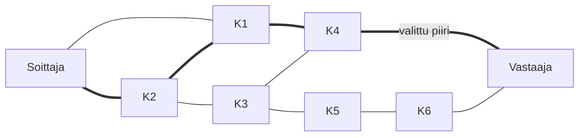
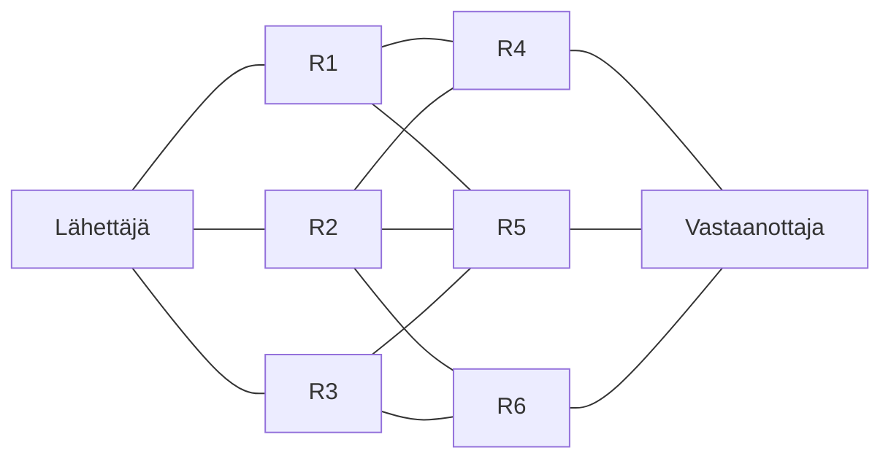

Aiemmasta luvusta tiedämme, että verkko välittää informaatiota tietokoneiden välillä. Informaatiota voi välittää lukemattomilla eri tavoin, mutta eri tapoja voi pyrkiä luokittelemaan erilaisiin ryhmiin. Tässä luvussa esitellään joitakin tapoja.

## Paketti vai piiri

Tiedonsiirtoa voi suorittaa piirikytkentäisesti (eng. circuit-swithing) tai pakettivälitteisesti (eng. packet-swithing). Tiedonsiirto on piirivälitteistä, kun keskustelun, tai tiedonvälityksen, aikana käytetään yhtä kommunikaatioreittiä. Reittiä eli piiri kuljettaa viestin lähettäjältä vastaanottajalle ja kenties myös takaisin. Piiri voi olla aina staattinen tai se voidaan luoda tarpeen mukaan. Tarpeen mukaan luotua piiriä käytetään perinteisessä puhelinverkossa. 1800-luvun lopussa puhelinkeskukset olivat käsivälitteisiä: keskuksen työntekijä yhdisti kaapelit siten että soittajan ja vastaajan välille syntyi piiri puhelun ajaksi. Käsikäyttöiset laitteet korvattiin 1900-luvun alkuvaiheilla automaattisilla, mutta periaate pysyi samana: soittajan ja vastaajan välille rakennetaan puhelun ajaksi piiri.

**Kuvio 1:** *Soittajan ja vastaajan välille rakennettu reitittimistä koostuva verkosto. Huomaa, että mahdollisia reittejä on useita, mutta koko keskustelun ajan käytetään reittiä Soittaja-K2-K1-K4-Vastaaja. Seuraavalla soittokerralla reitti voi olla eri.*

!!! question "Tehtävä"
    Mieti tai selvitä, missä tapauksessa voi olla tarpeellista rakentaa staattinen eli pysyvä piiri.

Pakettivälitteinen tiedonsiirto poikkeaa piirivälitteisestä merkittävästi. Piiriä ei luoda laisinkaan vaan informaatio lähetetään paketteina vastaanottajalle. Vastaanottajan tehtäväksi jää muodostaa eri reittejä kulkeneista paketeista kokonaisuus. Kuvitellaan tilanne, jossa huonekaluliike IKEA lähettää pöydän kolmessa eri paketissa: pöytälevy, jalat ja kuusiokoloavain kaikki eri Posti-paketeissa. Kaikilla kolmella paketilla on oma JFFI-koodia ja ne voivat löytää vastaanottajan luo hyvin eri reittiä. Epäonnisessa tilanteessa kasaamisen kannalta kriittinen kuusiokoloavain kulkee Vantaa-:truck:-Kuopio-:truck:-Kajaani reitin sijasta reittiä Vantaa-:ship:-Tallinna-:ship:-Tukholma-:ship:-Gdańsk-:ship:-Malmö-:truck:-Luulaja-:ship:-Oulu-:truck:-Kajaani.

**Kuvio 2:** *Lähettäjän ja vastaanottajan välille rakennettu reitittimistä koostuva verkosto. Jokainen peräkkäin lähetetty paketti voi kulkea eri reittiä.*

!!! question "Tehtävä"

    Mieti tai selvitä, mitä hyötyjä ja haittoja on kummassakin tiedonsiirtotavassa. Onko jompi kumpi parempi, vai onko lopputulema "riippuu"?

!!! question "Tehtävä"

    Mieti mitä tapahtuu, jos reittimet R5 ja R6 luulevat vastaanottajan asuvan graafin vasemmalla puolella eli ne on konfiguroitu väärin. Paketti kulkee reittiä `Lähettäjä -> R3 -> R5 -> R2 -> R6 -> R3 -> (repeat)` eli jää ikuiseen looppiin. Kuinka tältä voi välttyä? Kuinka Posti estäisi tämän? Entä internetin reitittimet?

Protokollaperheet koostuvat kerroksista, ja eri kerroksilla voi olla eri näkymys tiedonsiirrosta. Kuvittele, että yhdistät internetiin isoäidin vintiltä löytyneellä 56 kbps modeemilla, joka käyttää vanhaa lankapuhelinverkkoa tiedonsiirtoon. TCP/IP:n mukaisesti kapseloisit pyynnön IP-paketteihin. Kuten nimestä voi arvata, kyseessä on nimenomaan paketti, ja IP-paketit käyttävät pakettivälitteistä tiedonsiirtoa. Samaan aikaan modeemin hyödyntämä puhelinlinja on piirikytkentäinen. Käytät siis kumpaakin, mutta eri tasoilla!

!!! tip

    Kuvittele, että oikeasti selaisit internetiä 2020-luvulla 56 kbps modeemilla. Alla pikainen iltasanomat.fi etusivun (ilman scrollailua) lataamisesta tehty laskelma.

    | Keksit    | Koko (Mt) | Pyynnöt (#) | Karkea latausaika (56 kbps) |
    | --------- | :-------: | :---------: | --------------------------- |
    | Kielletty |    1.7    |     77      | 4 min                       |
    | Sallittu  |    2.7    |     195     | 6 min 30 s                  |
    
    :exploding_head: Mikäli olisit mediakonsernin kanssa yhtä mieltä, että saat parempia palveluita ja kohdennettuja mainoksia hyväksymällä evästeet, saisit odottaa pelkkien evästeiden latautumista kaksi ja puoli minuuttia. 

## Kytkennäisyys

Protokollat voivat käyttää yhteyttä (eng. connection), toiselta sanaltaan kytkentää, tai olla käyttämättä. Näistä kahdesta tiedonsiirron käytänöstä käytetään termejä kytkentäinen (eng. connection-oriented) ja ei-kytkentäinen (eng. connectionless). Huomaathan, että jatkossa käytän kytkennästä termiä yhteys.

Yhteyden muodostavaa protokollaa käyttävä viestijä lähettää yhteyden muodostamisesta pyynnön toiselle osapuolelle. Yhteys neuvotellaan aloitettavaksi, ja yhteyttä tarpeen mukaan ylläpidetään protokollan määrittelemällä tavalla, ja lopulta yhteys suljetaan sovitulla tavalla. Tästä voinee jo arvata, että piirikytkentäisessä tiedonsiirrossa on pakko muodostaa yhteys eli kytkentä. Suomennetuissa termeissä näillä onkin jo varsin vahva linkki jo ihan sanatasolla. (piiri**kytkentäinen** ja kytkentäinen). 

Yhteydetöntä protokollaa käyttävä viestijä lähettää viestin ilman yhteyttä. Käytetyt termit auttavat tässä. Ei-kytkentäisten (eng. connectionless) protokollien viesteistä käytetään termiä datagram (esim. UDP datagram), joka viittaa termiin telegram (suom. sähke), ja kääntyy suomeksi datasähkeeksi. Ei-kytkentäisiä protokollia ja sähkeitä yhdistää se, että kumpaakaan ei ole pakko kuitata vastaanotetuksi (eng. acknowledge, lyhennettynä ACK.)

!!! note

    Huomaathan että 
    

    1. Kaikki piirikytkentäiset (circuit-swithing) protokollat käyttävät yhteyttä eli ovat kytkentäisiä (eng. connection-oriented).
    2. Kaikki yhteyden muodostavat eli kytkentäiset (eng. connection-oriented) eivät käytä piiriä (eng. circuit)
    
    Vertaa
    
    3. Fakta: Kaikki :apple:omenat kasvavat :deciduous_tree:puussa
    4. Ei-Fakta: Jokaisessa :deciduous_tree:puussa kasvaa :apple:omenoita

Kertaus ja vahvistus: yhteydetöntä eli ei-kytkentäistä protokollaa käyttävä viestijä ei muodosta yhteyttä: se vain ampuu viestin menemään. 

Yhteyksiä voi kuitenkin muodostaa ilman pakettivälitteisissä verkoissa (eli ilman piiriä.) TCP-protokolla on kytkentäinen protokolla (eli siis connection-oriented), vaikka se hyödyntää TCP/IP-protokollaperheen mukaisesti IP-paketteja tiedonsiirtoon, ja IP-paketit ovat postipakettien tapaisesti pakettivälitteisiä (packet-switching) eivätkä muodosta piiriä. Näin toimivat FTP-tiedonsiirtoprotokolla, Telnet-pääteyhteysprotokolla, joidenkin verkkomoninpelien pelisessiot ja niin edelleen.

## Matriisi

Alla 2x2 matriisi, jossa esimerkkiprotokollat eri kombinaatioista.

|                                              | Ei-kytkentäinen connectionless | Kytkentäinen connection-oriented |
| -------------------------------------------- | ----------------------------------- | ------------------------------------- |
| **Piirikytkentäinen circuit-switching** | --                                  | PPP, MPLS                             |
| **Pakettivälitteinen packet-switching** | UDP, ICMP, QUIC                     | TCP, MQTT                             |

!!! question "Tehtävä"

	Selvitä, mitkä ovat hyödyt ja haitat UDP:n ja TCP:n välillä. Mihin tarkoituksiin ne soveltuvat?