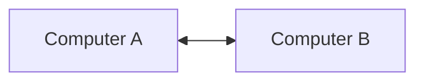
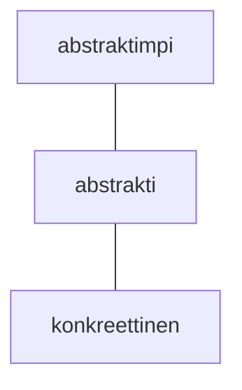

Erilaisiin tietoverkkoihin on vaikea olla törmäämättä. Verkot ovat niin yleisiä, että määrittely saattaa tuntua itsestään selvältä tai väkinäiseltä: aivan kuin määrittelisi muutoin yleisesti tutun sanan kuten *ruoka* tai *kaveri*. Määrittely on silti tässä yhteydessä tarpeen. Tieotokoneverkko (eng. computer network) viittaa useista tietokoneista koostuvaan kokonaisuuteen. Verkkotyöskentely (eng. networking) tarkoittaa niitä prosesseja, jotka liittyvät verkkkojen suunnitteluun, toteuttamiseen, hallintaan. On huomattavaa, että sekä verkkoja että verkostoitumista (eng. networking) voi käyttää kohtalaisen luontevasti myös ihmisten välisessä kommunikaatiossa. Tällä kurssilla sana verkko viittaa kuitenkin nimenomaan tietokoneverkkoon.

Yksinkertaisimmillaan verkko on kahden tietokoneen välinen yhteys. Yhteys voi olla myös ei-fyysinen, kuten kahden virtuaalikoneen välinen verkko. Verkko ei välttämättä liity mitenkään HTML-tiedostoihin tai termiin WWW. Bluetooth, lähimaksu ja televisioverkko ovat kaikki verkkoja.

**Kuvio 1:** *Kahdesta tietokoneesta, A ja B, koostuva kaksisuuntainen verkko.*

!!! note "Määritelmä"
    (Tietokone)verkko on kahdesta tai useammasta toisiinsa loogisesti tai fyysisesti yhdistetystä tietokoneesta koostuva kokonaisuus, joka mahdollistaa informaation vaihtamisen.

## Verkkojen kerrokset

Verkkotyöskentelyyn liittyvät teknologiat kuvataan usein erilaisilla malleilla, joissa niiden eri toiminallisuudet on siilottu eri kerroksiin (eng. layers). Jokaisella kerroksella on tehtävä. Jokainen kerros tuottaa ylemmälle palvelua, ja ylempi käyttää alemman palvelua. Kahden kerroksen välissä on yhteisesti sovittu rajapinta (eng. interface). Koska jokainen kerros tuottaa ylemmälle palvelua, alin kerros suorittaa konkreettisinta tehtävää ja ylin abstrakteinta.

!!! question "Tehtävä"
    Lue ja varmista, että ymmärrät termin "abstrakti" ohjelmistonkehityksen kontekstissa oikein. Tämä artikkeli on suositeltu lähde: [The Valuable Dev: What Are Abstractions in Software Engineering with Examples](https://thevaluable.dev/abstraction-type-software-example/)

**Kuvio 2:** *Kuvitteellinen 3-kerroksinen verkkoja kuvaava malli.*

Tällä kurssilla käsitellään kahta mallia: ISO-standardisoimisjärjestön OSI-mallia sekä TCP/IP Reference Modelia.

!!! warning
    Termit malli, protokolla ja protokollaperhe sekaantuvat helposti, mikäli ei ole tarkkana. Esimerkiksi sana TCP esiintyy mallissa (TCP/IP Reference Model), protokollassa (TCP), sekä protokollaperheessä (TCP/IP).
    
    * Malli (eng. model)
        * Yksinkertaistettu presentaatio monimutkaisesta prosessista tai ilmiöstä (vrt. Bohrin atomin malli).
    * Protokolla (eng. protocol)
        * Protokolla eli käytäntö on verkkotyöskentelyssä saman kerroksen entiteettien säännöstö. Esimerkkeinä TCP, IP, HTTP.
    * Protokollaperhe (eng. protocol suite)
        * Useista yhteensopivista protokollista koostuva kommunikointiin käytetty kokonaisuus. Esimerkkenä TCP/IP eli Internet Protocol Suite tai IPX/SPX.