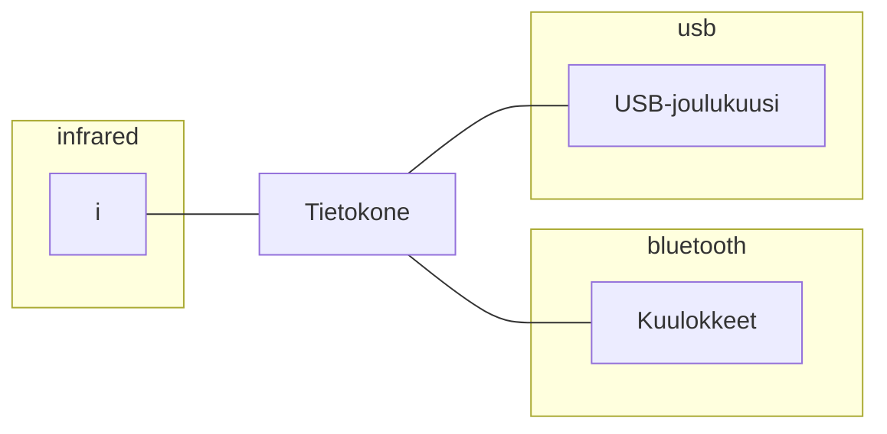
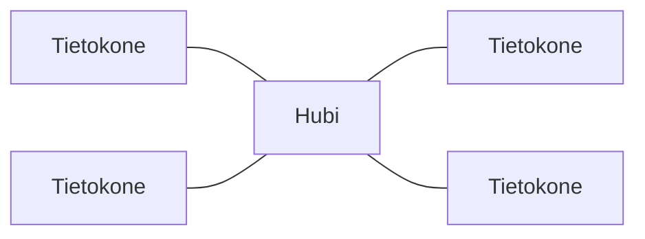

Jos edellisissä kappaleissa termistön suhteen on tuntunut pientä epävarmuutta, niin nyt ollaan vahvasti epävarman äärellä. Skaalan mukaan nimetyt tietoverkkotyypit, joista tässä luvussa käsitellään PAN, LAN ja WAN. Skaalan mukaan jakamiseen liittyy sama ongelma kuin virtaavan veden määrittely: joki, oja vai puro? Tietoverkon luokittelulle koon mukaan löytyy kuitenkin perusteluita. Eri skaalan verkkoihin sopivat eri datayhteydet ja topologiat.

!!! question "Tehtävä"
    Selvitä mitä muita lyhenteitä löytyy kuin PAN, LAN ja WAN. Mikä on esimerkiksi MAN?


## PAN

Pienin tässä kappaleessa käsitelty verkon skaala on likiverkko, omaverkko tai henkilökohtainen verkko eli PAN (Personal Area Network). Likiverkossa laitteet ovat sananmukaisesti erittäin likellä; metrin tai kahden päässä toisistaan. Koska laitteet ovat hyvin lähekkäin toisiaan, tämä myös herkästi tarkoittaa että niitä operoi yksi henkilö.

Topologian kannalta likiverkko voi olla hyvinkin yksinkertainen; tietokone on keskuslaite, ja se yhdistyy suoralla linkillä muihin laitteisiin.


**Kuvio 1:** *Tietokone ja sen PAN-laitteet*

Mahdollisia datayhteyden protokollia:

* USB
* Bluetooth
* IrDA (Infrapunavalo)

!!! question "Tehtävä"
    Mieti mihin käyttäisit infrapunaa likiverkossa.


## LAN

Lähiverkko (Local Area Network, LAN) on pelaajille tuttu termistä *lanit* (eng. LAN party). LAN voi joko olla kaapeloitu tai langaton eli WLAN (Wireless LAN). Huomaa, että sinulla voi olla kotona esimerkiksi kaksi LAN-verkkoa. Ethernet on joukko standardeja, ja nykyiset lähiverkot ovat lähes poikkeuksetta jonkin Ethernet-standardin mukaisia (esim. BASE100-TX, toiselta nimeltään Fast Ethernet). Yksi verkko toimii parikaapeleilla (esimerkiksi 100BASE-TX), toinen on langaton (esimerkiksi 2.4 GHz 802.11g). Nykyisen, Ethernet-lähiverkon topologia on siis tyypillisesti tähti (ks. kuva 2. Se näyttää tähdeltä.) Kotona oleva lähiverkko tunnetaan myös nimellä kotiverkko.



**Kuvio 2:** *Neljästä tietokoneesta ja hubista koostuva lähiverkko*

Lähiverkossa dominoivia datayhteyden standardeja:

* Ethernet (IEEE 802.3)
* Wireless Ethernet (IEEE 802.11)

!!! question "Tehtävä"
    Miksi ja miten voit striimata kuvaa Wifiin kytkeytyneestä kännykästä televisioon, joka on parikaapelilla kiinni siinä laitteessa, jota kutsut modeemiksi. Nehän ovat kahdessa eri lähiverkossa! Vai ovatko?

??? info "Historiaa: Lähiverkko ilman hubia"
    Laneja järjestettiin jo aikoja ennen nykymuotoista Ethernetiä, jossa koneet yhdistetään parikaapeleilla hubiin, kytkimeen tai muuhun matolaatikkoon. Moninpelaaminen oli usein jopa *lokaalimpaa* kuin nykypäivän laneilla; Internet-yhteyttä ei usein, joten yksi lähiverkon koneista oli pelisession isäntäkone.

    Verkko oli thinnet (10BASE) ja kaapelointiin käytettiin koaksiaalikaapelia, eli hyvin vastaavanlaista kaapelia kuin television ja antenni/kaapelirasian välillä. Jokaisen modeemin BNC-liittimeen kytkettiin T-adapteri. Esimerkiksi Tietokoneen B (ks. Kuvio 2) T-liittimestä lähtee yksi koaksiaalikaapeli koneeseen A ja toinen koneeseen C. Verkon päädymmäisissä koneissa T-adapterin muutoin tyhjään liittimeen pitää kytkeä terminaattori, joka on pieni vastus. Hubi ei ollut pienissä verkoissa tarpeellinen.
    
    Kuvitellaan, että laneilla on useampi pelaajaa, joista joku keskimmäisistä haluaa lähteä kotiin. Hän irroittaa tietokoneensa verkosta, jolloin segmentti katkeaa kahdeksi (ilman terminaattoreita). Lanit pitää pysäyttää hetkeksi, jotta segmentti voidaan yhdistää kaapeleille takaisin yhdeksi.
    
    ```mermaid
    graph LR
        T0((Terminaattori)) --- C1
        C1[Tietokone A] --- C2
        C2[Tietokone B] --- C3
        C3[Tietokone C] --- TX((Terminaattori))
    ```
    **Kuvio 2:** *Thinnet-lähiverkossa kaikki koneet kytkeytyvät samaan runkoon, joka kulkee koneesta toiseen T-liittimien läpi.**


## WAN

Alue- tai kaukoverkko (Wide Area Network, WAN) yhdistää laitteita, tai verkkoja, jotka ovat suurella etäisyydellä toisistaan. LAN-teknologioilla (esimerkiksi Ethernet over Fiber) voi yhdistää hyvinkin kaukana toisistaan olevia lähiverkkoja, mutta harva yritys yhdistäisi esimerkiksi New Yorkin ja Kajaanin toimistot LAN-teknologioilla toisiinsa. WAN:n voi luoda esimerkiksi vuokraamalla kiinteän linjan (eng. leased line), joka on yksityinen fyysinen yhteys kohteiden välillä. Kyseinen yhteys ei mene Internetin läpi eikä ole muillakaan tavoin jaettu; se on firman omassa käytössä. Kiinteä linja käyttää sarjaliitäntää ja data kapseloidaan HDLC tai PPP protokollia käyttäen - ei siis Ethernet-protokollaa käyttäen.

Yksityisen WAN:n voi luoda  julkiverkon läpi käyttäen virtuaalisia erillisverkkoja eli VPN-teknologioita (Virtual Private Network). Vuokratut kiinteät linjat ovat kalliita, joten Internetin läpi tehty VPN on tapa säästää rahaa. Mikäli reititin on konfiguroitu oikein, käyttäjän ei tarvitse erikseen ladata VPN-sovellusta yrityksen lähiverkossa (site-to-site VPN joka käyttää IPsec:iä): reititin hoitaa kryptauksen  lähtöpäässä ja enkryptauksen vastaanottavan toimiston päässä. Sen sijaan poissa toimistolta olevat etätyöntekijät tarvitsevat erillisen VPN-sovelluksen (remote-access VPN joka käyttää TLS:ää).

Kuten Internet, palveluntarjoajien MPLS-verkot (Multiprotocol Label Swithing) ovat asiakkaiden kesken jaettuja verkkoja. MPLS-intran sisälle luodaan VPN-verkkoja tunnuksia (eng. label) käyttäen, jotka korvaavat IP-osoitteet MPLS-verkossa. Palveluntarjoja lisää asiakkaan Ethernet-paketteihin tunnukset, joita käytetään palveluntarjoajan reitittimien välisessä liikennöinnissä. Asiakkaan oma verkko hyödyntää yhä IP-osoitteita tavalliseen tapaan: oikein konfiguroidut verkko reitttineen varmistaa, että toiseen toimistoon suunnatut paketit päätyvät palveluntarjoajan MLPS edge-reittimelle eivätkä kulje julkisen Internetin läpi. 

Joitakin mahdollisia WAN-protokollia:

* HDLC
* PPP
* Ethernet + IPsec (VPN)
* MPLS

Useista yhteen kytketyistä verkoista käytetään termiä ==internetwork== (`inter` + `network`) tai lyhyesti ==internet==. Mikä tahansa useista verkoista koostuva verkko on siis internet, mutta suurella alkukirjaimella kirjoitettu Internet on erisnimi. Internet on siis myös WAN, mutta kokoluokaltaan sen verran suuri, että harvemmin sitä kutsutaan WAN:ksi. Se on ihan vain Internet. Yleisesti WAN:lla viitataan yritysten yksityisiin tai julkiverkon läpi tunneloituihin yhteyksiin, jotka yhdistevät maantieteellisesti kaukana toisitaan olevat lähiverkot (toimistot, datakeskukset, yms.). Mikäli yrityksen omassa sisäverkossa (joka voi olla WAN) pyörii Internetin kaltaisesti käyttäytyvä privaatti internet, siitä käytetään nimeä *intranet*. Mikäli tämä oma, privaatti internet, on avoinna myös joillekin toisille tahoilla, on sen nimi *extranet*.

:book: [Mozilla: How does the internet work](https://developer.mozilla.org/en-US/docs/Learn/Common_questions/Web_mechanics/How_does_the_Internet_work)