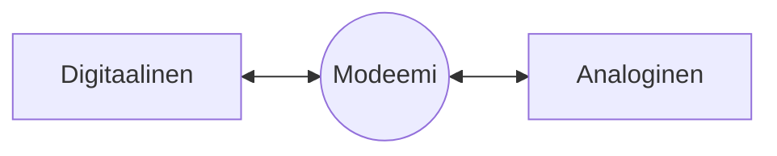
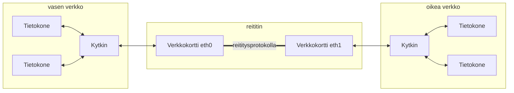
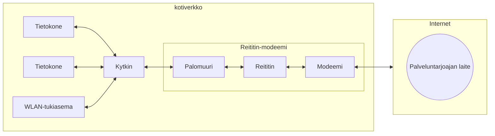

Tämä luku pyrkii käsittelemään konkreettisesti laitteita, jotka liittyvät TCP/IP- ja siten Internet-tiedonvälitykseen ja Ethernet-protokollaan. Toisin sanoen, näitä sinulta voi löytyä kotoa. Jokaisen alla olevan otsakkeen perässä lukee suluissa, millä OSI-tasolla laite korkeimmillaan toimii. OSI-tasot käsitellään myöhemmin, mutta tästä saat hyvää osviittaa siihen, mitä ylemmän tason suurempi abstraktio voi tarkoittaa käytännössä.

## Toistin (Taso 1)

Toistin tai toistinasema (eng. repeater) on yksinkertainen laite, joka ottaa sisääntulevan signaalin, puhdistaa ja vahvistaa sitä, ja siirtää sen lähtöön. Toistin ei puutu viestin sisältöön: se ei ymmärrä mitään MAC-osoitteista, IP-osoitteista tai TCP-protokollista. Sen tehtävä on lisätä verkkoon kantamaa.

## Keskitin (Taso 1)

Keskitin (eng. hub) on Ethernet-lähiverkoissa rasia, jossa on kasa naaraspuolisia liittimiä, joihin voit kytkeä parikaapelin liittimen (RJ-45-liitin). Kaikki hubiin kytketyt tietokoneet voivat jatkossa kommunikoida keskenään. Huomaathan, että vaikka tässä puhutaan hubista Ethernet-lähiverkon kannalta, niin myös muilla verkottamiseen liittyvillä teknologioilla voi olla hubi, kuten USB-hubi. Aivan kuten yllä mainittu toistin, myöskään keskitin ei ymmärrä MAC-osoitteista, IP-osoitteista tai muusta datan sisällöstä mitään.

Hubiin kytketyt laitteet jakavat saman dataväylän. Vain yksi voi lähettää viestin kerrallaan, muut odottavat vuoroaan. Tästä käytetään termiä vuorosuuntainen (eng. half-duplex). Kaikki saavat kaikkien lähettämät viestit. Toisten viestejä ei siis varsinaisesti tarvi salakuunnella: saat ne väkisin. Ylemmän tason protokolla hylkää viestit, jotka eivät kuulu vastaanottajalle. Vai hylkäävätkö ... :spy:

Käytännössä keskittimen on kotikäytössä korvannut kokonaisuudessa kytkin.

## Kytkin (Taso 2)

Kytkin (eng. switch) on muutoin samanlainen laatikko kuin keskitin, mutta käyttää viestien välittämiseen MAC-osoitteita eli tietokoneiden fyysisiä osoitteita. Näin tietokoneelta toiselle lähetetty viesti voidaan lähettää vain vastaanottajan porttiin (vtr. keskitin, joka lähettää kaikki viestit kaikille).

!!! question "Tehtävä"
	Selvitä, mikä on silta (eng. bridge) ja miten se eroaa, jos mitenkään, kytkimestä.

Kytkin mahdollistaa myös kaksisuuntaisen (eng. full-duplex) viestinnän. Tämä vaatii hieman selittämistä:

* Yksisuuntainen (eng. simplex)
  * Kaapeli tai muu kanava voi siirtää tietoa vain yhteen suuntaan. (Mikäli liikennettä halutaan kumpaankin suuntaan, tulee rakentaa meno- ja paluukanava kahdesta kaapelista vierekkäin. Tätä käyttävät optiset kuituyhteydet, ja kyseessä on tällöin kaksisuuntainen yhteys, joka selitetään alla.)
* Vuorosuuntainen (eng. half-duplex)
  * Kaapeli (tai muu) voi siirtää tietoa kumpaankin suuntaan, mutta vain yhteen suuntaan kerrallaan. Kuvittele yksikaistainen silta tai tunneli (näitä löytyy ainakin Islannista.) Keskittimen tapauksessa kaikki lähiverkon tietokoneet vuorottelevat saman dataväylän käytöstä, mistä syntyy väkisinkin törmäilyä (eng. collisions). Kuvittele liikenneympyrä, jossa saa olla kerrallaan vain yksi auto.
* Kaksisuuntainen (eng. full-duplex)
  * Kaapeli (tai muu) voi siirtää tietoa kumpaankin suuntaan yhtä aikaa. Kuvittele kaksikaistainen tie. Kaksisuuntainen yhteys voi olla kerrallaan vain kahden tietokoneen välissä, joten jos keskustevia koneita on useita, kaksisuuntaisia yhteyksiä tulee olla useita.

Mikäli sinulla on kaksi 16-porttista kytkintä, niin voit ketjuttaa ne (eng. daisy chain) tavallisella parikaapelilla, jolloin sinulle jää `(16 - 1) * 2` eli 30 porttia käytettäväksi. Voit pitää 30 pelaajan lanit! Useista kytkimistä voi rakentaa myös tähtikuvion verkon, jossa jokaisen sakaran päässä on kytkin. Lopputulos näyttää hieman lumihiutaleelta: :snowflake:.

Osa kytkimistä on hallittavia, joten niillä on oma IP-osoite, johon voi kirjautua verkkoselaimella. Verkko-osoitteesta löytyvästä hallintapaneelista voi hallita asetuksia.

!!! question "Tehtävä"
    Selvitä, onko MAC-osoite aina pysyvästi sama yhdellä laitteella, vai voiko tietokone väittää omaksi MAC-osoitteekseen jonkin toisen laitteen MAC-osoitteen - tai hatusta temmatun MAC-osoitteen.

## Modeemi (Taso 1)

Modeemi (eng. modem, lyhenne sanasta **mo**dulator-**dem**odulator), tai muunnin, on laite joka muuntaa digitaalisen signaalin eli OSI-mallin (tason 1) bitit analogiseksi signaaliksi eli sähköksi, valoksi, radioaalloiksi, tai muuksi. Luonnollisesti laite osaa muuttaa myös analoogisen signaalin takaisin digitaaliseksi, jotta paluukanava voi toimia. Tyypillisessä kodissa voi olla kaapelimodeemi, ADSL, tai esimerkiksi 4G/5G-modeemi. Modeemilla otetaan yhteys Internet-palveluntarjoajaan (ISP), esimerkiksi KaisaNetiin tai Teliaan.

**Kuvio 1:** *Modeemin toiminta pelkistettynä*

!!! warning 
    Huomaa, että modeemissa on lähtökohtaisesti vain yksi sisäänmeno ja yksi ulostulo. Kaupassa myytävä laite, esimerkiksi kaapelimodeemi, on yleensä useita eri laitteita sisältävä kokonaisuus, johon kuuluu esimerkiksi 5-porttinen kytkin, langattoman verkon liityntäpiste (eng. Wireless Access Point, WAP), reititin, palomuuri, http-palvelin, DNS-palvelin, NAT, DHCP-palvelin ynnä muuta.

## Reititin (Taso 3)

Reititin (eng. router) on laite, joka yhdistää eri verkkoja toisiinsa. Yllä mainittuja kytkittimiä voi ketjuttaa, mutta niiden tulee lähtökohtaisesti olla samaa tyyppiä, kuten Ethernetiä, ja kytkennän lopputuloksesta muodostuu käytännössä yksi iso verkko. Reititin mahdollistaa ==keskenään erilaisten== verkkojen yhdistämisen toisiinsa - toki verkot voivat olla myös samanlaisia. Reitittimen voi kytkeä myös toiseen reitittimeen, ja reitittimistä voi rakentaa suuren verkon, kuten vaikkapa Internetin. Tällöin reititin voi yhdistää LAN:n ja WAN:n toisiinsa. Huomaa, että reitittimessä voi olla myös enemmän kuin 2 verkkokorttia, jolloin se voi yhdistää useita eri verkkoja yhteen tähtimäisesti.

**Kuvio 2:** *Reititin yhdistää kaksi lähiverkkoa*

!!! question "Tehtävä"
	Selvitä, kuinka Raspberry Pi:stä, eli tunnetusta yhden piirilevyn tietokoneesta, voi rakentaa kaksi langallista verkkoa yhdistävän reitittimen käyttäen OpenWrt Linux-distribuutiota. Yksi verkko kytketään Raspberry Pi:n Ethernet-verkkoporttiin, mutta mihin ihmeeseen toinen?

Tyypillisesti kotiverkon reitittimeen (tai reititin-modeemiin) voi kirjautua verkkoselaimella samalla tavalla kuin hallittaviin kytkimiin. Verkko-osoitteesta löytyvästä hallintapaneelista voi säätää yleisesti DHCP-asetuksia, modeemin asetuksia, ja paljon muuta.

!!! question "Tehtävä"
	Kuvittele tilanne, jossa sinulla on **oikeasti** vain modeemi, mutta ei reititintä. Kuinka monta tietokonetta voit kytkeä Internetiin? Mieti, mitä tapahtuu jos kytket modeemista saapuvan Ethernet-kaapelin kytkimeen, ja kytket siihen 5 tietokonetta. Onko tällä jotakin yhtäläisyyksiä kotisi reititin-modeemin "Bridge Mode"-tilaan.

## Palomuuri (Taso 3-7)

Palomuuri (eng. firewall) on "turvallisuus-tietoinen reititin". Palomuuri voi toimia hyvinkin monella OSI-mallin tasolla, riippuen sen toteutuksesta. Palomuuri voi olla erillinen laite, tai sisäänrakennettuna reititin-modeemiin, tai täysin ohjelmallinen. Ohjelmallisia palomuureja ovat esimerkiksi Windows Defender Firewall tai Linux-maailmasta tuttu UFW (Uncomplicated Firewall).

Alemmin tason (3) palomuuri toimii yksinkertaisilla IP-osoite ja porttisäännöille, jotka myöntävät tai estävät pääsyn - englanniksi *allow rules* tai *deny rules*. Säännöillä on suunta joko sisään tai ulospäin - englanniksi *inbound* tai *outbound*. Palomuuri voi esimerkiksi estää kaiken ulkopuolelta saapuvan liikenteen porttiin TCP/22. Ylimmän tason palomuuri (7) ei tyydy tarkastelemaan IP-osoitteita vaan analysoi kuorman (eng- payload) sisältöä tarkemmin. Tällöin palomuuri voi noudattaa sääntöjä, jotka perustuvat HTTP-kyselyn sisältöön.

**Kuvio 3:** Reititin-modeemin sisukset, mukaan lukien palomuuri, piirrettynä auki. Kotiverkko on kytketty Internetiin palveluntarjoajan nimeämättömän laitteen läpi.

!!! question "Tehtävä"
	Päättele, mikä tai mitä laitteita palveluntarjoajan päässä on vastassa (Kuviossa 3.)
